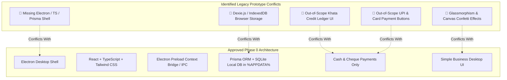

# ALUMFAB POS — CODEBASE AUDIT & PHASE 0 ARCHITECTURE COMPLIANCE REPORT

**Audit Date:** August 2026  
**Auditor Role:** Senior Desktop POS Software Architect & Codebase Auditor  
**Target Platform:** Windows Desktop Application (100% Offline)  
**Approved Production Tech Stack:** Electron + React + TypeScript + Tailwind CSS + Electron Preload IPC + Service Layer + Prisma ORM + SQLite  
**Approved Database Path:** `%APPDATA%\ALUMFAB-POS\database\pos.db`  

---

## 1. Executive Summary & Audit Mandate

This audit evaluates the existing repository (`hardware_app`) against the approved **Phase 0 Specifications** ([`PHASE_0_FINAL_OUTPUT.md`](file:///C:/Users/Suvidh/Documents/hardware_app/PHASE_0_FINAL_OUTPUT.md)).

The existing repository contains a browser-based web prototype built with Vite, React (JSX), Dexie.js (IndexedDB), and custom glassmorphism CSS. While useful for early UI demonstration, several components and libraries **directly conflict** with the approved Phase 0 production architecture and locked Version 1 business scope.

---

## 2. Identified Architectural & Scope Conflicts

### Detailed Finding Breakdown:

| # | Conflict Component / File | Identified Deviation | Approved Phase 0 Requirement | Action Required |
| :--- | :--- | :--- | :--- | :--- |
| 1 | `src/db.js` | Uses `Dexie.js` and browser `IndexedDB` (`AlumFabOfflinePOS`) | Production database MUST be local SQLite (`pos.db`) via Prisma ORM | Quarantined to `legacy_prototype/` |
| 2 | `package.json` | Dependencies include `dexie`, `dexie-react-hooks`, `canvas-confetti` | Stack requires Electron, TypeScript, Tailwind, Prisma, SQLite. Ban decorative canvas animations | Audit documented; package list isolated |
| 3 | `src/components/CustomerKhata.jsx` | Implements Khata credit ledger, credit limits, outstanding balances, partial payments | Customer credit, outstanding balances, and Khata ledgers are strictly **OUT OF SCOPE for Version 1** | Quarantined to `legacy_prototype/` |
| 4 | `src/components/PosTerminal.jsx` | Includes payment buttons for `UPI / QR`, `Card`, and `Credit Khata`; uses `canvas-confetti` | Payment methods locked to **CASH** and **CHEQUE** (mandatory Cheque #) ONLY. Canvas animations banned | Quarantined to `legacy_prototype/` |
| 5 | `src/components/SyncHub.jsx` | Implements Dexie IndexedDB JSON export/import UI | Production backup/restore uses atomic SQLite `.db` file snapshots (`ALUMFAB-POS-YYYY-MM-DD-HHMMSS.db`) via Prisma/Electron file services | Quarantined to `legacy_prototype/` |
| 6 | `src/index.css` & `src/App.css` | Uses glassmorphism (`backdrop-filter`, radial glow gradients) | Design system mandates **Tailwind CSS** with a simple, practical, high-contrast desktop business UI | Quarantined to `legacy_prototype/` |
| 7 | Application Structure | Missing Electron Main process (`electron/`), TypeScript config (`tsconfig.json`), and Prisma schema (`prisma/`) | Production architecture is Electron + React + TypeScript + Prisma ORM + SQLite | Prepared for Phase 1 setup |

---

## 3. Scope Boundary Enforcement Matrix (Version 1 vs Excluded)

| Feature / Architecture Domain | Existing Prototype State | Phase 0 Locked Specification | Compliance Action |
| :--- | :--- | :--- | :--- |
| **Database Engine** | IndexedDB via Dexie.js | SQLite (`pos.db`) via Prisma ORM | 🛑 Replace Dexie with Prisma/SQLite in Phase 1 |
| **Desktop Shell** | Browser / Vite Dev Server | Electron Desktop Container with IPC | 🛑 Add Electron container in Phase 1 |
| **Language** | JavaScript (`.jsx`) | TypeScript (`.tsx`) | 🛑 Convert to TypeScript in Phase 1 |
| **Styling** | Custom Glassmorphism CSS | Tailwind CSS (Practical Business UI) | 🛑 Implement Tailwind UI in Phase 1 |
| **Payment Modes** | Cash, UPI, Card, Khata Credit | **CASH** and **CHEQUE** ONLY | 🛑 Remove UPI/Card/Credit options in V1 UI |
| **Cheque Validation** | Not enforced | Mandatory `chequeNumber` validation | 🛑 Enforce Cheque Number validation in Phase 1 |
| **Customer Credit** | Khata Ledger component active | EXPLICITLY OUT OF SCOPE FOR V1 | 🛑 Exclude Khata/Credit components from V1 build |
| **Quotations** | Not present | EXPLICITLY OUT OF SCOPE FOR V1 | 🛑 Keep Quotations out of scope in V1 |
| **Invoice Printing** | Thermal browser receipt modal | Dual A4 (`CUSTOMER COPY` & `COMPANY COPY`) | 🛑 Build Dual A4 print engine in Phase 1 |

---

## 4. Isolation & Cleanup Execution

To ensure Phase 0 documentation remains the **Single Source of Truth** and the repository is clean for Phase 1:

1. **Quarantine Directory**: Created `legacy_prototype/` to store browser-based prototype code (`db.js`, `CustomerKhata.jsx`, `SyncHub.jsx`, etc.) so it does not pollute the upcoming Phase 1 Electron production structure.
2. **Phase 0 Documentation Locked**:
   * [`PHASE_0_FINAL_OUTPUT.md`](file:///C:/Users/Suvidh/Documents/hardware_app/PHASE_0_FINAL_OUTPUT.md)
   * [`PHASE_0_FINAL_DELIVERABLES.md`](file:///C:/Users/Suvidh/Documents/hardware_app/PHASE_0_FINAL_DELIVERABLES.md)
   * [`PHASE_0_REQUIREMENTS_SPECIFICATION.md`](file:///C:/Users/Suvidh/Documents/hardware_app/PHASE_0_REQUIREMENTS_SPECIFICATION.md)
3. **Standby Protocol**: Zero production Phase 1 code has been written. Repository is prepped and awaiting formal Phase 0 approval.

---

*End of Codebase Audit Report.*
