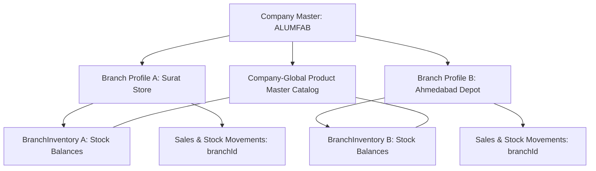
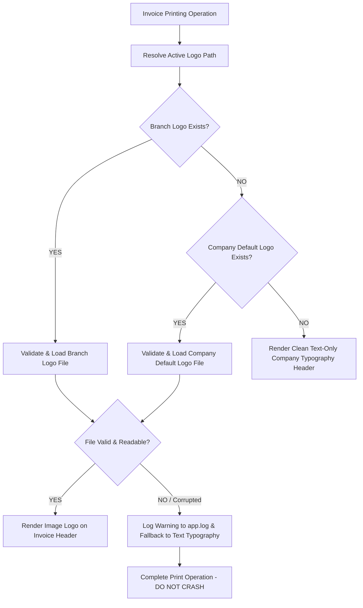

# ALUMFAB POS — PHASE 0 BRANCH ARCHITECTURE & PRODUCT DATASET AMENDMENT

**Document Version:** 4.0.0 (Master Phase 0 Amendment Specification)  
**Date:** August 2026  
**Status:** APPROVED & LOCKED  
**Application Name:** ALUMFAB POS  
**Target Operating System:** Windows Desktop (100% Offline Application)  
**Target Architecture Stack:** Electron + React + TypeScript + Tailwind CSS + Electron Preload IPC + Service Layer + Prisma ORM + SQLite  
**Production Database Path:** `%APPDATA%\ALUMFAB-POS\database\pos.db`  

> [!IMPORTANT]
> **Scope Amendment Relationship**: This document extends the approved Phase 0 Requirements Specification. It does NOT replace or invalidate unrelated previously approved foundation rules (100% offline, local SQLite, single Admin, Cash/Cheque only, A4 dual-copy printing, zero negative stock).

---

## A. REASON FOR AMENDMENT
This amendment incorporates real-world operational requirements provided by the company regarding:
1. Multi-branch company profiles under a single company identity (`Company` 1-to-N `Branch`).
2. Admin-editable branch details (Address, GSTIN, Phone, State, Invoice Prefix, Company & Branch Logos).
3. Active Branch context (`Sale.branchId`) and per-branch stock balance management (`BranchInventory`).
4. Historical invoice immutability via branch and product snapshot fields (`Sale` & `SaleItem` snapshots).
5. Real product dataset mapping and validation rules for the company's 182-item spreadsheet (`hardware.ods`).

---

## B. CONFIRMED NEW COMPANY REQUIREMENTS
* **Single Company, Multi-Branch Model**: Single commercial identity (ALUMFAB) operating through one or more physical branches.
* **Editable Branch Settings**: Admin can edit Address, GSTIN, Phone, State, Invoice Prefix, and Logo per branch.
* **File-Based Local Logo Asset Management**: Logos stored in `%APPDATA%\ALUMFAB-POS\assets\logos\`. Fallback: `Branch Logo -> Company Default Logo -> Text-Only Header`. Corrupted or missing logos fall back gracefully to text-only headers without crashing.
* **Branch-Aware Invoicing**: Unique invoice prefixes (e.g. `SRT-INV-`, `AMD-INV-`) and dynamic date tokens (`ALF-{YYYY}{MM}-`).
* **Branch-Aware Inventory**: Company-Global Product Master catalog (`Product`), branch-scoped stock balances (`BranchInventory`), and per-branch zero negative stock pre-checks.
* **Product Dataset Ingestion Pipeline**: Read-only ingestion of [`hardware.ods`](file:///C:/Users/Suvidh/Documents/hardware_app/hardware.ods) with dry-run validation preview and explicit conflict strategies (`SKIP`, `UPDATE EXISTING`, `CANCEL`).
* **Soft-Deactivation Rule**: Branches and Products are deactivated (`isActive = false`), NEVER hard-deleted.
* **Asset-Aware Backup Package**: `.zip` archive bundling `pos.db` + `%APPDATA%\ALUMFAB-POS\assets\logos\` + `manifest.json`.

---

## C. COMPANY + BRANCH DOMAIN MODEL



---

## D. BRANCH DATA FIELDS & EDITABILITY

```prisma
model Branch {
  id               String            @id @default(uuid())
  companyId        String
  company          Company           @relation(fields: [companyId], references: [id])
  name             String            // Required Branch Name (e.g. "Surat Main Store")
  address          String?           // Editable multiline address (allows initial blank)
  gstin            String?           // Editable 15-digit GSTIN (allows initial blank)
  phone            String?           // Editable phone number (allows initial blank)
  state            String?           // Editable state (e.g. "Gujarat") for GST split
  invoicePrefix    String            @default("ALF-INV-") // Editable sequence prefix
  logoPath         String?           // Editable local logo asset path
  isActive         Boolean           @default(true) // Deactivation flag (Soft delete)
  createdAt        DateTime          @default(now())
  updatedAt        DateTime          @updatedAt
  inventories      BranchInventory[]
  sales            Sale[]
  stockMovements   StockMovement[]
  invoiceSequences InvoiceSequence[]
}
```

---

## E. LOGO MANAGEMENT & CORRUPTION HANDLING RULES



* **Storage Path**: `%APPDATA%\ALUMFAB-POS\assets\logos\`
* **Upload Validation**: Image mime-type and binary header check (`PNG`, `JPG`, `JPEG`, `WEBP`).
* **Corrupted Logo Protection**: If a logo file is corrupted or unreadable at print time, log a non-fatal warning to `app.log` and render text-only typography. Invoice creation and printing MUST NEVER crash due to corrupted image files.

---

## F. ACTIVE BRANCH RULES
* Every billing session, stock adjustment, and report executes under an **Active Branch** context loaded during app launch (`MAIN_STORE` by default).

---

## G. BRANCH-AWARE INVENTORY RULES
* Product catalog definitions (`Product` entity) are **Company-Global**.
* Stock balances are maintained per branch via `BranchInventory` (`branchId + productId` unique constraint).
* **Per-Branch Zero Negative Stock Block**: Stock pre-checks validate against the active branch inventory ($\text{BranchInventory.quantity (Active Branch)} - \text{Requested Qty} \ge 0$).

---

## H. BRANCH-AWARE SALES RULES
* Every finalized sale MUST be linked to a `branchId` (`Sale.branchId`).
* Payment modes are strictly **CASH** and **CHEQUE** (mandatory Cheque #).
* Tax Evaluation Matrix:
  * **Intra-State (`Branch State == Customer State` or omitted)**: 50% CGST (9%) + 50% SGST (9%), `IGST = 0`.
  * **Inter-State (`Branch State != Customer State`)**: 100% IGST (18%), `CGST = 0`, `SGST = 0`.

---

## I. HISTORICAL INVOICE SNAPSHOT RULES

Master entity updates (editing branch address/GSTIN or updating product master prices) **NEVER** alter historic invoice records.

### Immutable `Sale` Header Snapshots:
`branchNameSnapshot`, `branchAddressSnapshot`, `branchGstinSnapshot`, `branchPhoneSnapshot`, `branchStateSnapshot`, `invoicePrefixSnapshot`, `logoSnapshot`, `customerNameSnapshot`, `customerAddressSnapshot`, `customerGstinSnapshot`, `customerStateSnapshot`.

### Immutable `SaleItem` Line Item Snapshots:
`productSkuSnapshot`, `productNameSnapshot`, `profileSnapshot`, `alloySnapshot`, `finishSnapshot`, `sellingUnitSnapshot`, `unitPricePaise`, `weightPerPieceSnapshot`, `totalWeightKg`, `lineTotalPaise`, `gstRateSnapshot`, `taxableAmountPaise`, `gstAmountPaise`, `cgstPaise`, `sgstPaise`, `igstPaise`.

---

## J. INVOICE SEQUENCE RULES
* Sequence counters are tracked per branch prefix (`InvoiceSequence`: `branchId + prefix -> nextNumber`).
* Supports dynamic date tokens (e.g. `ALF-{YYYY}{MM}-` produces `ALF-202601-000001` for January 2026 sales). Numbers are unique, sequential, non-recyclable, and persistent across restarts and backups.

---

## K. PRODUCT DATASET MAPPING (`hardware.ods`)

The company spreadsheet [`hardware.ods`](file:///C:/Users/Suvidh/Documents/hardware_app/hardware.ods) (182 hardware items) is treated as a **READ-ONLY** source file. It must never be altered or overwritten.

| Spreadsheet Column | Target Model Field | Data Type | Transformation & Validation Rules |
| :--- | :--- | :--- | :--- |
| `HardwareName` | `Product.name` | String | Required commercial product name |
| `ProductCode` | `Product.sku` | String | Unique Product Code / SKU |
| `Price` | `Product.sellingPricePaise` | Int | Converted to integer paise ($\text{Price} \times 100$) |
| `Per` | `Product.sellingUnit` | Enum | Normalized: `PCS`, `KG`, `FT`, `METER`, `LENGTH`, `SET` |
| `Barcode` | `Product.barcode` | String | Optional barcode string (e.g. `*H101*`) |

*Unit Normalization & `RFT` Rule*: Case-insensitive normalization (`Pcs`, `pcs` -> `PCS`). For `RFT` (Running Feet), store `sellingUnit = "RFT"` (or `FT` upon company confirmation) while preserving `sourceUnit = "RFT"` in importer metadata to prevent data loss.

---

## L. PRODUCT IMPORT VALIDATION RULES
1. **Mandatory Execution Pipeline**: Select File -> Parse Dataset -> Normalize Columns/Units -> Run Validation Checks -> Display Import Preview Summary (`Total Rows`, `Valid`, `Warnings`, `Errors`, `New`, `Updated`, `Skipped`) -> Admin Confirms Conflict Strategy (`SKIP`, `UPDATE EXISTING`, `CANCEL IMPORT`) -> Commit Valid Import.
2. **Pre-Validation Checks**: Missing Name (ERROR), Missing SKU (ERROR/Warning), Duplicate SKU (ERROR), Duplicate Barcode (Warning/Error), Negative/Invalid Price (ERROR), Price = 0 (WARNING), Unknown Unit (WARNING), Empty Barcode (Allowed).
3. **No Silent Overwriting**: Existing prices are NEVER silently overwritten without explicit Admin choice.

---

## M. UPDATED DOMAIN ENTITY LIST (14 ENTITIES)
1. `Company`, 2. `Branch`, 3. `CompanySetting`, 4. `Product`, 5. `Category`, 6. `BranchInventory`, 7. `StockMovement`, 8. `Customer`, 9. `Sale`, 10. `SaleItem`, 11. `Payment`, 12. `InvoiceSequence`, 13. `BackupMetadata`, 14. `AuditLog`.

---

## N. BACKUP PACKAGE & LOGO ASSET RULES
* Database backup generates an **Asset-Aware Backup Package Archive** (`.zip`) containing `pos.db` + `%APPDATA%\ALUMFAB-POS\assets\logos\` + `manifest.json`.
* Restoring a backup restores ALL branches, branch data, and logo files simultaneously. Restoring only the active branch is forbidden.

---

## O. NEW RISKS / EDGE CASES MITIGATION MATRIX

| # | Risk / Edge Case | Identified Impact | Technical Architecture Mitigation Strategy |
| :--- | :--- | :--- | :--- |
| 1 | **Duplicate Invoice Prefix Across Branches** | Sequence collision risk | Enforce composite unique constraint `[branchId, prefix]` in `InvoiceSequence`. |
| 2 | **Duplicate Invoice Number** | Audit failure | Enforce global unique index on `Sale.invoiceNo`. |
| 3 | **Branch GSTIN Missing During Invoice** | GST compliance warning | Prompt Admin warning; allow B2C sales; require GSTIN for B2B GST invoices. |
| 4 | **Branch State Missing** | Tax split ambiguity | Prompt Admin to set Branch State before generating GST tax breakdown. |
| 5 | **Customer State Missing** | Tax split ambiguity | Default Customer State to Branch State (Intra-State CGST+SGST split). |
| 6 | **Logo File Deleted / Corrupted Outside App** | Broken print render | Defensively catch load error; log warning to `app.log`; fallback to text-only typography. |
| 7 | **Invalid Product Import File** | Catalog pollution | Parse dry-run; reject invalid file structure with explicit error report. |
| 8 | **Duplicate Product Code in Import** | Database constraint error | Flag row as error during dry-run validation preview; block import until resolved. |
| 9 | **Duplicate Barcode** | Scanner mismatch | Flag duplicate barcode warning in preview summary. |
| 10 | **Unknown / Unmapped Unit** | Unit mismatch | Flag warning in preview; prompt Admin to map unit or preserve `sourceUnit`. |
| 11 | **Zero Product Price** | Free billing risk | Flag warning in preview preview summary for Admin review. |
| 12 | **Negative Product Price** | Financial corruption | Enforce strict validation error ($\text{Price} \ge 0$); reject row. |
| 13 | **Branch Changed After Sale** | Historical audit mismatch | `Sale` stores immutable snapshot fields (`branchNameSnapshot`, `branchAddressSnapshot`, etc.). |
| 14 | **Product Name Changed After Sale** | Historic invoice mutation | `SaleItem` stores `productNameSnapshot`, `productSkuSnapshot`, `profileSnapshot`. |
| 15 | **Product Price Changed After Sale** | Historic invoice mutation | `SaleItem` stores `unitPricePaise`, `gstRateSnapshot`, `lineTotalPaise`. |
| 16 | **Branch Deactivation With Existing Stock** | Orphan inventory | Block branch deactivation or warn Admin to transfer/adjust inventory first. |
| 17 | **Branch Deactivation With Historic Sales** | Audit breakage | Enforce `isActive = false` (**DEACTIVATE, NOT DELETE**). Preserve historical references. |
| 18 | **Backup Missing Logo Assets** | Broken logo on restore | Backup engine bundles SQLite database + `%APPDATA%\ALUMFAB-POS\assets\logos\` into `.zip`. |
| 19 | **Restore With Broken Logo Reference** | Print render error | Restore unpacks logo files to asset folder; fallback to text-only typography if missing. |
| 20 | **Import Updating Product Unexpectedly** | Overwritten prices | Require explicit Admin strategy selection (`SKIP`, `UPDATE EXISTING`, `CANCEL IMPORT`). |
| 21 | **No Cloud Sync Between Physical Branches** | Expectation gap | Document 100% offline single installation model; zero cloud sync in V1. |

---

## P. UPDATED VERSION 1 SCOPE DEFINITION

### ✅ Included in Version 1:
Company Master, Branch Master, Editable Branch Details (Address, GSTIN, Phone, State, Prefix, Logo), Active Branch Context, Immutable Historic Branch & Product Snapshots, Branch-Aware Invoice Sequence, Company-Global Product Master Catalog, BranchInventory (`branchId + productId`), Per-Branch Zero Negative Stock Block, Local Logo Management, Asset-Aware Backup Package Archive (`.zip`), Product Dataset Ingestion Pipeline (`hardware.ods`), Cash & Cheque Payment (Mandatory Cheque #), A4 Dual-Copy Printing.

### 🛑 Excluded from Version 1:
Cloud Branch Sync, Real-Time Inter-Branch Online Sync, Central Cloud Server, Remote Branch Dashboards, Customer Credit / Khata, Digital Payments (UPI / Cards), Quotation Module UI, Sales Returns / Cancellations, Multi-User RBAC Permissions, Heavy Animations / Confetti.

---

## Q. ACCEPTANCE CHECKLIST

- [x] **1. Single Company model retained**: Single commercial identity (ALUMFAB) locked.
- [x] **2. Branch entity introduced**: `Branch` domain entity defined.
- [x] **3. Address editable per branch**: Multiline address editable per branch.
- [x] **4. GSTIN editable per branch**: 15-digit GSTIN editable per branch.
- [x] **5. Phone editable per branch**: Phone number editable per branch.
- [x] **6. State editable per branch**: State name editable per branch.
- [x] **7. Invoice prefix editable per branch**: Custom invoice prefix editable per branch.
- [x] **8. Logo upload supported conceptually**: Local logo upload workflow locked.
- [x] **9. Logo replace supported conceptually**: Local logo replacement workflow locked.
- [x] **10. Logo delete supported conceptually**: Logo deletion and text-only fallback locked.
- [x] **11. Company default logo fallback supported**: Logo hierarchy (`Branch -> Company -> Text`) locked.
- [x] **12. Active Branch concept documented**: Active Branch context locked.
- [x] **13. Sale.branchId required**: Mandatory `branchId` relation locked.
- [x] **14. Historical branch snapshot required**: Immutable `Sale` branch snapshots locked.
- [x] **15. Branch-aware invoice sequence documented**: `InvoiceSequence` counter per branch locked.
- [x] **16. Products remain global**: Company-Global `Product` master catalog locked.
- [x] **17. Inventory moved conceptually to BranchInventory**: `BranchInventory` (`branchId+productId`) locked.
- [x] **18. Stock validation operates branch-wise**: Per-branch zero negative stock pre-check locked.
- [x] **19. StockMovement.branchId documented**: `StockMovement.branchId` relation locked.
- [x] **20. Real ODS dataset recognized**: `hardware.ods` (182 items) recognized as read-only source.
- [x] **21. HardwareName mapping documented**: `HardwareName -> Product.name` mapped.
- [x] **22. ProductCode mapping documented**: `ProductCode -> Product.sku` mapped.
- [x] **23. Price mapping documented**: `Price -> Product.sellingPricePaise` mapped.
- [x] **24. Per/unit mapping documented**: `Per -> Product.sellingUnit` mapped.
- [x] **25. Barcode mapping documented**: `Barcode -> Product.barcode` mapped.
- [x] **26. Unit normalization documented**: Case-insensitive unit normalization locked.
- [x] **27. Zero-price warning documented**: Zero-price warning in preview locked.
- [x] **28. Duplicate SKU validation documented**: Duplicate SKU error check locked.
- [x] **29. Duplicate barcode handling documented**: Duplicate barcode warning locked.
- [x] **30. Import dry-run documented**: Import dry-run preview pipeline locked.
- [x] **31. Explicit update/skip conflict strategy documented**: Conflict options (`SKIP`, `UPDATE`, `CANCEL`) locked.
- [x] **32. Missing GST metadata is NOT invented**: Missing GST fields remain optional until provided.
- [x] **33. Branch assets included in backup planning**: Asset-aware backup package archive (`.zip`) locked.
- [x] **34. Historical SaleItem snapshot requirement documented**: Immutable `SaleItem` snapshots locked.
- [x] **35. Branch deactivate-not-delete rule documented**: `Branch.isActive = false` soft-delete locked.
- [x] **36. Product deactivate-not-delete rule documented**: `Product.isActive = false` soft-delete locked.
- [x] **37. No cloud branch synchronization added**: 100% offline model locked.
- [x] **38. Existing Cash/Cheque rules unchanged**: CASH and CHEQUE (mandatory Cheque #) locked.
- [x] **39. Existing Phase 0 architecture unchanged**: Electron + React + TypeScript + Prisma + SQLite locked.
- [x] **40. Corrupted logo handling strategy documented**: Non-fatal warning log + text-only fallback locked.

---

## R. PHASE 1 READINESS STATEMENT

**Phase 0 Status:** COMPLETE  
**Phase 0 Branch & Dataset Amendment:** COMPLETE  
**Repository State:** READY FOR PHASE 1  

*STATEMENT:*  
**"Phase 0 requirements, specifications, dataset amendments, import architecture, and multi-branch rules are complete, locked, and approved."**  
*Phase 1 implementation will NOT start automatically. The repository is prepped and standing by for formal Phase 0 approval.*
