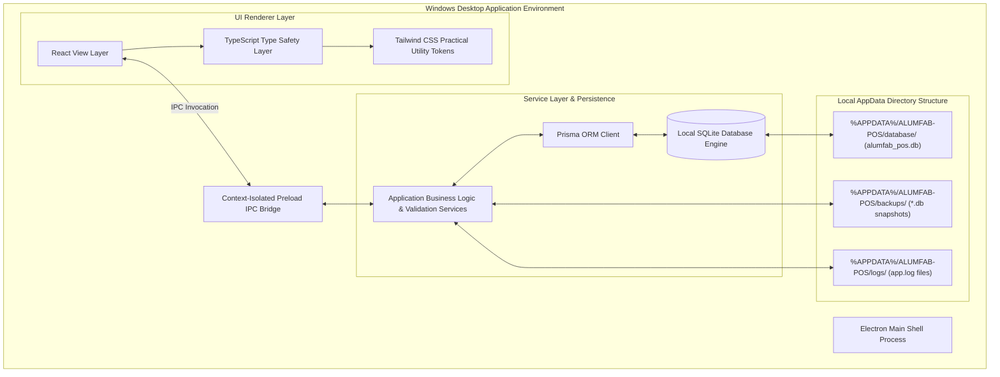
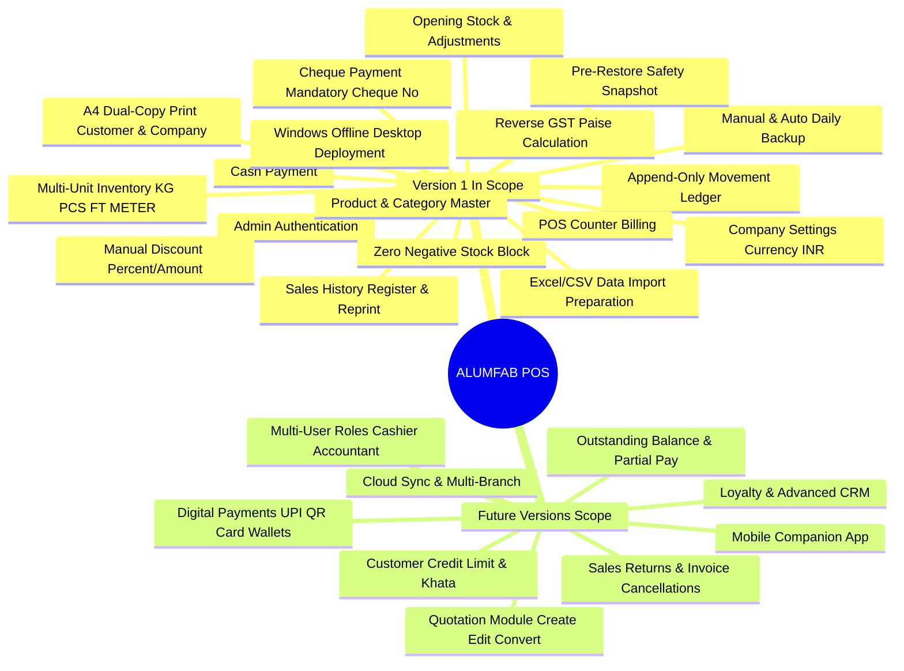
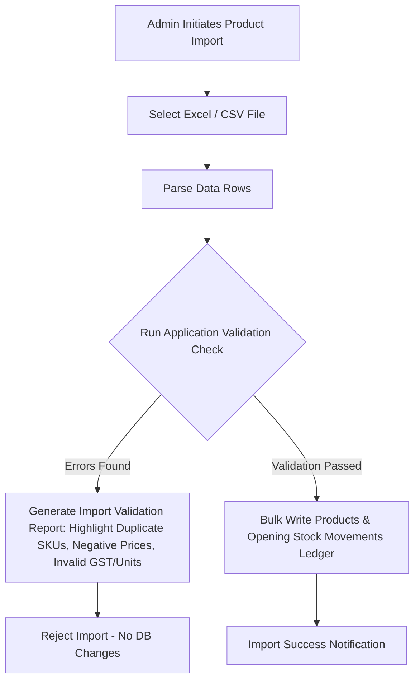
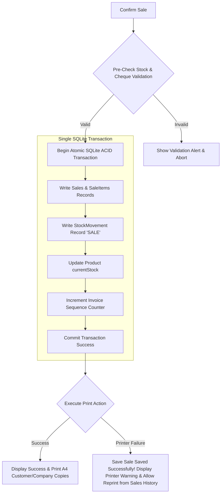
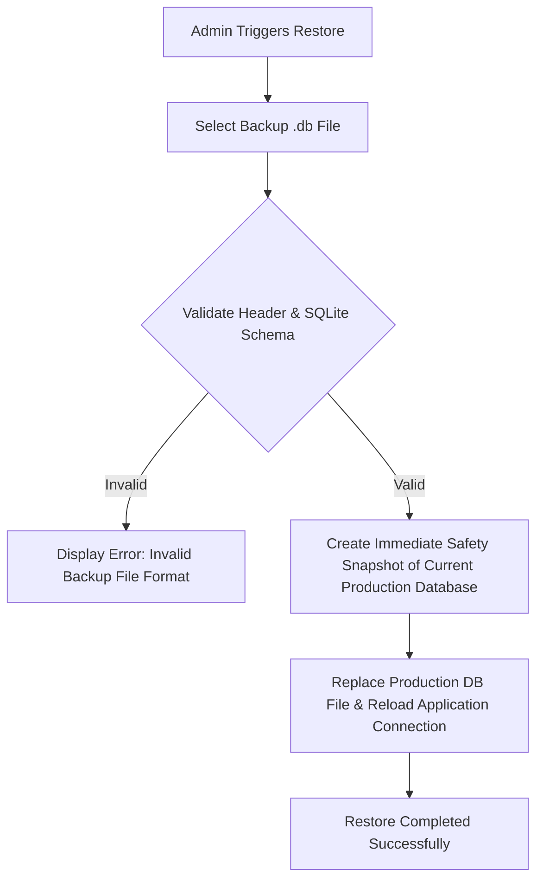

# ALUMFAB POS — PHASE 0 FINAL SPECIFICATION & DELIVERABLES DOCUMENT

**Document Version:** 3.0.0 (Final Phase 0 Master Deliverable)  
**Project Name:** ALUMFAB POS  
**Business Type:** Bulk Aluminum Products & Aluminum Hardware Trading  
**Target Platform:** Windows Desktop Application (100% Offline Application)  
**Planned Target Tech Stack:** Electron + React + TypeScript + Tailwind CSS + Electron Preload IPC + Prisma ORM + SQLite  
**Phase Status:** PHASE 0 SCOPE & REQUIREMENTS LOCKED (Zero Production Code in Phase 0)  

---

# DELIVERABLE 1: FINAL REQUIREMENTS SUMMARY

## 1.1 Executive Overview & Business Goal
**ALUMFAB POS** is an offline-first Windows desktop Point of Sale (POS) and business management system engineered specifically for bulk aluminum products, extrusions, structural metal sections, and hardware traders. 

The primary goal of Version 1 is to provide a reliable, simple, and practical desktop business application for:
* Product Master Catalog & Excel/CSV Import Preparation
* Multi-Unit Aluminum Inventory Tracking (`KG`, `PCS`, `FT`, `METER`, `LENGTH`, `SET`)
* Counter Sales Billing & Manual Discounts
* Customer Directory Management
* Integer Paise GST Tax Calculation & A4 Dual-Copy Invoicing
* Sales History Register & Auditing
* Cash & Cheque Payment Settlement
* Zero Negative Stock Control via Append-Only Movement Ledger
* Manual & Automatic Local Database Backup / Restore

## 1.2 Desktop Architecture & Data Storage Environment
The application operates 100% locally without cloud dependencies, external web APIs, or online database services.



### Data Directory Architecture (`%APPDATA%\ALUMFAB-POS\`):
1. **Database Directory**: `%APPDATA%\ALUMFAB-POS\database\alumfab_pos.db`
   * *Rule*: The production SQLite database lives strictly inside the Windows user application data directory (`%APPDATA%`), NEVER inside the installation folder (`Program Files`). The production database must NEVER be bundled as a replaceable file inside the installation package.
2. **Backups Directory**: `%APPDATA%\ALUMFAB-POS\backups\` (Stores manual and automated `.db` backup files).
3. **Logs Directory**: `%APPDATA%\ALUMFAB-POS\logs\` (Stores operational error and audit log files).

## 1.3 Local Currency & System Settings
* **Default Currency**: Indian Rupee (**INR / ₹**).
* **Storage**: All system settings (Company Name, Address, GSTIN, Phone, State, Logo path, Invoice Prefix, Backup Directory path, Default Currency) are stored locally in the SQLite `CompanySetting` table.

## 1.4 Critical Reliability & Printing Principles
1. **ACID Sales Transactions**: Sales, stock movement ledger entries, and inventory decrements execute inside a single atomic SQLite database transaction.
2. **Decoupled Printing Reliability Rule**:
   * If printing fails AFTER a sale is saved in the database:
     1. **Do NOT roll back the valid sale transaction**.
     2. Save Sale Successfully.
     3. Display a non-blocking printing error alert to the operator.
     4. Allow operator to Reprint invoice copies at any time from Sales History.
     5. Printing and database transaction integrity MUST remain completely separate concerns.
3. **Integer Money Accuracy**: Monetary amounts are calculated and stored as integer minor units (paise, $1\text{ INR} = 100\text{ paise}$) to prevent floating-point rounding errors.

---

# DELIVERABLE 2: FEATURE SCOPE (VERSION 1 VS FUTURE VERSIONS)



## Side-by-Side Scope Matrix:

| Feature Domain | Version 1 (In-Scope) | Future Versions (Out-of-Scope for V1) |
| :--- | :--- | :--- |
| **Operating Environment** | 100% Offline Windows Desktop (Electron + SQLite) | Multi-Branch Cloud Sync / Mobile App |
| **User Roles** | Single `ADMIN` Role (Full Access) | Multi-Role Permission System (`CASHIER`, etc.) |
| **Product Units** | `KG`, `PCS`, `FT`, `METER`, `LENGTH`, `SET` | Dynamic Custom Unit Builders |
| **Data Import** | Excel / CSV Product Import Validation | Automated Supplier PO Generation |
| **Pricing & Tax** | Paise Currency Logic + Reverse GST Calc | Customer-Specific Saved Price Matrices |
| **Discounts** | Manual Discount (%, ₹) at Billing Time | Automatic Customer / Loyalty Discounts |
| **Stock Control** | Zero Negative Stock Block + Append-Only Ledger | Automated Low-Stock Purchase Orders |
| **Payment Modes** | **CASH** & **CHEQUE** (Mandatory Cheque #) | **UPI**, **Cards**, **Net Banking**, **Wallets** |
| **Customer Credit** | 100% Full Payment at Checkout | Credit Limit, Outstanding Balance, Khata |
| **Invoice Print** | Single Print Action -> Dual A4 (`CUSTOMER` & `COMPANY`) | Thermal 3-inch POS Roll Printing |
| **Sales History** | Searchable Audit Register & Reprinting | Sales Returns & Invoice Cancellations |
| **Quotations** | Decoupled Architecture Only (No UI/Tables) | Quotation Create, Edit, Print, Convert |
| **Data Backup** | Manual + Auto Daily Backup + Safety Snapshot | Cloud Auto-Sync / Remote Cloud Backup |

---

# DELIVERABLE 3: BUSINESS RULES MATRIX

## 3.1 Product Business Rules
* **SKU Uniqueness**: Product SKU / Code must be unique when provided; duplicate SKUs are rejected.
* **Master Price Protection**: Manual billing discounts or rate adjustments never modify the underlying Product Master price.
* **Active Status**: Inactive products (`isActive = False`) are hidden from POS billing search but preserved for historic invoice rendering.

## 3.2 Unit & Conversion Business Rules
* **Supported Units**: `KG`, `PCS`, `FT`, `METER`, `LENGTH`, `SET`.
* **Theoretical Weight Rule**: Products sold in `PCS` with `weightPerPiece` metadata support dynamic weight calculation ($\text{Weight} = \text{PCS} \times \text{weightPerPiece}$). Theoretical weight conversion is never forced on general items without metadata.

## 3.3 Pricing & Manual Discount Rules
* **Price Attributes**: Each product defines `sellingPricePaise`, `gstRate`, and `priceIncludesGst`.
* **Manual Billing Adjustments**: Admin can manually adjust item rate or apply manual transaction discount (%, ₹) during billing.
* **Discount Audit**: All discounts are saved with the sale record (`discountType`, `discountValue`, `discountAmountPaise`, `discountNote`).

## 3.4 GST / Tax Calculation Rules (Integer Paise)
* **Reverse Taxable Calculation** (when `priceIncludesGst = True`):
  $$\text{Taxable Value (Paise)} = \text{Round}\left(\frac{\text{Inclusive Amount (Paise)}}{1 + \frac{\text{GST Rate}}{100}}\right)$$
* **Intra-State Tax Split**:
  $$\text{CGST (Paise)} = \text{Round}\left(\frac{\text{GST Amount (Paise)}}{2}\right), \quad \text{SGST (Paise)} = \text{GST Amount} - \text{CGST}$$
* **Inter-State Tax Split**: $\text{IGST (Paise)} = \text{GST Amount (Paise)}$.

## 3.5 Inventory & Zero Negative Stock Rules
* **Zero Negative Stock Enforcement**: Sales resulting in negative stock balances are strictly blocked ($\text{Current Stock} - \text{Requested Qty} \ge 0$).
* **Append-Only Ledger**: All inventory changes log entries in `stock_movements` (`OPENING_STOCK`, `PURCHASE`, `SALE`, `ADJUSTMENT_IN`, `ADJUSTMENT_OUT`).
* **Opening Stock**: Allowed during product creation and initial data import.

## 3.6 Customer Business Rules
* **Identity Rule**: `Customer Name` is the only mandatory identity field. Phone, Address, GSTIN, and State are optional.
* **Zero Credit Rule**: Customers do not maintain running credit ledgers or outstanding balances in Version 1.

## 3.7 Payment Method Business Rules
* **Supported Modes**: `CASH` and `CHEQUE` only.
* **Mandatory Cheque Number**: If payment method is `CHEQUE`, `chequeNumber` is **MANDATORY**. Transactions missing a cheque number are blocked.

## 3.8 Invoice & Sequence Numbering Business Rules
* **A4 Dual-Copy Print**: Single print action generates two A4 copies: `CUSTOMER COPY` and `COMPANY COPY`.
* **Non-Duplicating Sequence**: Sequential invoice numbering (`ALF-INV-000001`) stored in database settings. Existing invoice numbers are never duplicated, reused, or silently recycled. Sequence state persists across app restarts and backup restorations.

## 3.9 Backup & Data Protection Rules
* **Dual Backup Modes**: Manual Backup (Admin trigger) + Automatic Daily Backup.
* **Pre-Restore Validation**: Backup file header and SQLite schema must be validated before restore.
* **Pre-Restore Safety Snapshot**: System automatically creates an immediate Safety Backup of the current active database before replacing data during restore. Application updates must NEVER overwrite production database files.

---

# DELIVERABLE 4: CORE OPERATIONAL WORKFLOWS

## 4.1 Login Flow
1. Admin launches application -> System verifies local SQLite database in `%APPDATA%`.
2. Admin enters password credentials -> System validates hash -> Grants Admin session access.

## 4.2 Product Management & Import Validation Flow


## 4.3 Inventory & Opening Stock Flow
1. Admin selects Product -> Chooses Movement Type (`OPENING_STOCK`, `PURCHASE`, `ADJUSTMENT_IN`, `ADJUSTMENT_OUT`).
2. Input Quantity & Reference Note -> System writes `stock_movements` record -> Atomically updates `products.currentStock`.

## 4.4 Sales & Billing Counter Flow
1. Admin opens POS Terminal -> Selects Customer (Default or Custom).
2. Searches Product (`F2` shortcut) -> Inputs Quantity based on unit (`KG`, `PCS`, `FT`, `METER`).
3. Inputs manual price adjustment or manual discount (%, ₹) if authorized.
4. System executes **Stock Pre-Check Validation** (`currentStock >= requestedQty`).
5. System computes Taxable Value, CGST/SGST or IGST in integer paise units.
6. Admin clicks Checkout (`F8` shortcut).

## 4.5 Cash Payment Flow
1. Select Payment Method: `CASH`.
2. System confirms amount due -> Proceeds to Atomic Transaction.

## 4.6 Cheque Payment Flow
1. Select Payment Method: `CHEQUE`.
2. System prompts for `Cheque Number`.
3. If Cheque Number is blank -> **Block Transaction** & display validation error.
4. If Cheque Number is valid -> Save `chequeNumber` -> Proceed to Atomic Transaction.

## 4.7 Atomic Sales Transaction & Invoice Printing Flow


## 4.8 Backup Flow (Manual & Auto Daily)
1. Triggered manually by Admin or automatically on daily schedule.
2. System locks SQLite database safely -> Copies `.db` file to `%APPDATA%/ALUMFAB-POS/backups/ALUMFAB-POS-YYYY-MM-DD-HHMMSS.db`.
3. System writes entry in `BackupMetadata` log table.

## 4.9 Restore Flow (Validation & Safety Snapshot)


---

# DELIVERABLE 5: DATA ENTITY LIST & PRISMA SCHEMAS

The database schema comprises **10 core entities**:

```prisma
datasource db {
  provider = "sqlite"
  url      = "file:%APPDATA%/ALUMFAB-POS/database/alumfab_pos.db"
}

generator client {
  provider = "prisma-client-js"
}

// 1. Store & System Configurations
model CompanySetting {
  key         String   @id
  value       String
  updatedAt   DateTime @updatedAt
}

// 2. Product Categories
model Category {
  id          String    @id @default(uuid())
  name        String    @unique
  products    Product[]
  createdAt   DateTime  @default(now())
}

// 3. Product Master Catalog
model Product {
  id                 String          @id @default(uuid())
  sku                String          @unique
  name               String
  categoryId         String
  category           Category        @relation(fields: [categoryId], references: [id])
  brand              String?
  profile            String?
  size               String?
  finish             String?
  sellingUnit        SellingUnit     // KG, PCS, FT, METER, LENGTH, SET
  sellingPricePaise  Int
  gstRate            Decimal
  priceIncludesGst   Boolean         @default(false)
  weightPerPiece     Decimal?
  length             Decimal?
  currentStock       Decimal         @default(0.0)
  minStock           Decimal         @default(0.0)
  isActive           Boolean         @default(true)
  createdAt          DateTime        @default(now())
  updatedAt          DateTime        @updatedAt
  stockMovements     StockMovement[]
  saleItems          SaleItem[]
}

enum SellingUnit {
  KG
  PCS
  FT
  METER
  LENGTH
  SET
}

// 4. Customer Directory
model Customer {
  id          String   @id @default(uuid())
  name        String
  phone       String?
  address     String?
  gstin       String?
  state       String?
  notes       String?
  createdAt   DateTime @default(now())
  updatedAt   DateTime @updatedAt
  sales       Sale[]
}

// 5. Sales Invoice Entity
model Sale {
  id                 String       @id @default(uuid())
  invoiceNo          String       @unique // e.g. ALF-INV-000001
  createdAt          DateTime     @default(now())
  customerId         String
  customer           Customer     @relation(fields: [customerId], references: [id])
  subtotalPaise      Int
  discountType       DiscountType @default(NONE)
  discountValue      Decimal      @default(0.0)
  discountAmountPaise Int         @default(0)
  discountNote       String?
  taxableAmountPaise Int
  cgstPaise          Int
  sgstPaise          Int
  igstPaise          Int
  grandTotalPaise    Int
  totalWeightKg      Decimal      @default(0.0)
  items              SaleItem[]
  payment            Payment?
}

enum DiscountType {
  NONE
  PERCENTAGE
  FIXED_AMOUNT
}

// 6. Invoice Line Items
model SaleItem {
  id                 String   @id @default(uuid())
  saleId             String
  sale               Sale     @relation(fields: [saleId], references: [id])
  productId          String
  product            Product  @relation(fields: [productId], references: [id])
  unit               SellingUnit
  quantity           Decimal
  unitPricePaise     Int
  totalWeightKg      Decimal  @default(0.0)
  lineTotalPaise     Int
  gstRate            Decimal
  taxableAmountPaise Int
  gstAmountPaise     Int
}

// 7. Payment Settlement Entity
model Payment {
  id           String      @id @default(uuid())
  saleId       String      @unique
  sale         Sale        @relation(fields: [saleId], references: [id])
  mode         PaymentMode // CASH, CHEQUE
  chequeNumber String?     // Mandatory when mode == CHEQUE
  amountPaise  Int
  createdAt    DateTime    @default(now())
}

enum PaymentMode {
  CASH
  CHEQUE
}

// 8. Append-Only Inventory Movement Ledger
model StockMovement {
  id           String       @id @default(uuid())
  productId    String
  product      Product      @relation(fields: [productId], references: [id])
  type         MovementType // OPENING_STOCK, PURCHASE, SALE, ADJUSTMENT_IN, ADJUSTMENT_OUT
  quantity     Decimal
  unit         SellingUnit
  referenceNo  String?      // e.g. Invoice # or Adjustment ID
  notes        String?
  createdAt    DateTime     @default(now())
}

enum MovementType {
  OPENING_STOCK
  PURCHASE
  SALE
  ADJUSTMENT_IN
  ADJUSTMENT_OUT
}

// 9. Backup Metadata Audit Log
model BackupMetadata {
  id          String   @id @default(uuid())
  fileName    String
  filePath    String
  fileSizeBytes Int
  backupType  String   // MANUAL, AUTO_DAILY, PRE_RESTORE_SAFETY
  createdAt   DateTime @default(now())
}

// 10. Application Operation Audit Log
model AuditLog {
  id        String   @id @default(uuid())
  action    String   // e.g. LOGIN, PRODUCT_IMPORT, DB_RESTORE
  details   String?
  createdAt DateTime @default(now())
}
```

---

# DELIVERABLE 6: APPLICATION-LEVEL VALIDATION RULES

| Module | Validation Rule | Condition / Constraint | System Action on Failure |
| :--- | :--- | :--- | :--- |
| **Product Master** | SKU Uniqueness | `SKU` must be unique across `Product` table | Block save; show `"SKU [code] already exists."` |
| **Product Master** | Non-Negative Selling Price | `sellingPricePaise >= 0` | Block save; show `"Price cannot be negative."` |
| **Product Master** | Valid GST Rate | `gstRate >= 0 AND gstRate <= 100` | Block save; show `"GST rate must be 0-100%."` |
| **Inventory** | Zero Negative Stock | `currentStock - saleQty >= 0` | Block transaction; show `"Insufficient stock available."` |
| **Inventory** | Positive Movement Qty | `quantity > 0` for inventory adjustments | Block entry; show `"Quantity must be greater than 0."` |
| **Billing POS** | Positive Line Quantity | `lineItem.qty > 0` | Block cart addition; show `"Quantity must be > 0."` |
| **Billing POS** | Non-Empty Cart | `cart.length > 0` | Block checkout button |
| **Payment** | Mandatory Cheque Number | `paymentMethod == CHEQUE => chequeNumber != empty` | Block sale; show `"Cheque Number is mandatory for Cheque sales."` |
| **Invoice Numbering** | Non-Duplicating Invoice # | `invoiceNo` must be unique | Sequence auto-increment lock |
| **Product Import** | Import File Validation | Reject rows with missing names, invalid prices, duplicate SKUs | Abort import; generate Import Validation Report |
| **Backup Restore** | Pre-Restore Schema Check | Validate SQLite header & schema version | Reject file; show `"Invalid backup file schema."` |
| **Backup Restore** | Safety Snapshot Creation | Must create safety snapshot before replacing production `.db` | Abort restore if safety snapshot creation fails |

---
*End of Phase 0 Final Specification & Deliverables Document.*
