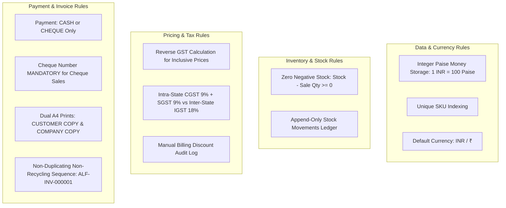

# ALUMFAB POS — PHASE 0 FINAL OUTPUT DOCUMENT

**Document Version:** 4.0.0 (Phase 0 Formal Sign-Off Deliverable)  
**Project Name:** ALUMFAB POS  
**Business Type:** Bulk Aluminum Products & Aluminum Hardware Trading  
**Target Operating System:** Windows Desktop (100% Offline Application)  
**Target Architecture Stack:** Electron + React + TypeScript + Tailwind CSS + Electron Preload IPC + Service Layer + Prisma ORM + SQLite  
**Phase Status:** PHASE 0 SCOPE & REQUIREMENTS LOCKED (Zero Production Code in Phase 0)  

---

# A. CONFIRMED REQUIREMENTS

1. **Business Type**: Dedicated POS and inventory management system for bulk aluminum profiles, structural metal extrusions, glass sections, and aluminum hardware trading.
2. **100% Offline Operational Integrity**: The application operates completely without internet connectivity, remote cloud APIs, web servers, or cloud authentication.
3. **Desktop Storage Architecture**:
   * Production SQLite database stored in `%APPDATA%\ALUMFAB-POS\database\alumfab_pos.db`.
   * Separate local subdirectories: `%APPDATA%\ALUMFAB-POS\backups\` and `%APPDATA%\ALUMFAB-POS\logs\`.
   * The production database must NEVER be bundled inside the application installation folder (`Program Files`) or overwritten by software installers.
4. **Local Currency**: Default currency is Indian Rupee (**INR / ₹**). All settings stored locally in SQLite.
5. **Decoupled Printing Reliability**: If printing fails AFTER a sale is committed to the database, the ACID sales transaction is **NOT** rolled back. The sale is saved successfully, a printer error warning is displayed, and invoice reprinting is enabled from Sales History.

---

# B. VERSION 1 FEATURES (IN-SCOPE)

* **Admin Authentication**: Local login and credential management.
* **Product & Category Master**: Manage products, categories, brands, profiles, finishes, and selling units.
* **Excel / CSV Product Dataset Import**: Bulk product dataset import with pre-import validation and error report generation.
* **Multi-Unit Inventory Engine**: Native support for `KG`, `PCS`, `FT`, `METER`, `LENGTH`, `SET`.
* **Opening Stock & Movement Ledger**: Opening stock setup and stock movement adjustments via append-only ledger (`OPENING_STOCK`, `PURCHASE`, `SALE`, `ADJUSTMENT_IN`, `ADJUSTMENT_OUT`).
* **Zero Negative Stock Control**: Block sales attempting to exceed available stock levels.
* **POS Counter Terminal**: High-speed billing with product search (`F2`), checkout modal (`F8`), keyboard hotkeys, and theoretical weight conversion metadata.
* **Manual Discounting**: Percentage (%) or fixed amount (₹) manual discounts applied at checkout.
* **Integer Paise GST Calculation Engine**: Integer paise monetary storage with reverse GST taxable amount calculations (Intra-State CGST 9% + SGST 9% vs Inter-State IGST 18%).
* **Cash & Cheque Payment Settlement**: Settlement via **CASH** or **CHEQUE** (with mandatory Cheque Number validation).
* **A4 Dual-Copy Tax Invoice Printing**: Single print action renders `CUSTOMER COPY` & `COMPANY COPY` on A4 paper.
* **Sales History Register**: Immutable sales history, search filters, and dual A4 invoice reprinting.
* **Company Settings**: Configure store name, address, GSTIN, phone, state, logo path, invoice prefix (`ALF-INV-`), default currency (₹), and backup directory.
* **Manual & Auto Daily Backup**: Manual and automated daily database snapshots (`ALUMFAB-POS-YYYY-MM-DD-HHMMSS.db`).
* **Database Restore with Pre-Restore Safety Snapshot**: Schema-validated restore protocol with automatic creation of a pre-restore safety snapshot of the active database.
* **Windows Desktop Deployment**: Offline Electron desktop application.

---

# C. DEFERRED FEATURES (OUT-OF-SCOPE FOR VERSION 1)

* 🛑 **Quotation Module**: Quotation UI screens, forms, tables, and conversion workflows are EXCLUDED in V1 (architecture decoupled for future implementation).
* 🛑 **Customer Credit / Khata**: Customer credit limits, outstanding balances, partial payments, payment installments, and credit ledgers are EXCLUDED.
* 🛑 **Digital Payments**: UPI, QR codes, Credit/Debit Cards, Net Banking, and Wallets are EXCLUDED.
* 🛑 **Sales Returns & Cancellations**: Sales returns (`SALE_RETURN`) and invoice cancellations are EXCLUDED in V1.
* 🛑 **Multi-User Permissions**: Multi-role permission matrices (`CASHIER`, `ACCOUNTANT`) are EXCLUDED (Single Admin role in V1).
* 🛑 **Cloud Sync & Remote Databases**: Firebase, Supabase, PostgreSQL, online auth, multi-company, multi-branch, mobile apps, and cloud syncing are EXCLUDED.

---

# D. BUSINESS RULES



1. **Integer Money Precision**: All prices and monetary totals are calculated and stored as integer paise ($1\text{ INR} = 100\text{ paise}$).
2. **Multi-Unit Conversion**: Theoretical weight conversion ($\text{Weight} = \text{PCS} \times \text{weightPerPiece}$) is applied only when product metadata exists.
3. **Reverse Tax Calculation**: For GST-inclusive prices:
   $$\text{Taxable Amount (Paise)} = \text{Round}\left(\frac{\text{Inclusive Amount}}{1 + \frac{\text{GST Rate}}{100}}\right)$$
4. **Tax Splitting**: Intra-State = 50% CGST + 50% SGST; Inter-State = 100% IGST.
5. **Zero Negative Stock**: Transactions exceeding available stock are strictly blocked at validation.
6. **Mandatory Cheque Number**: Transactions with payment method `CHEQUE` require a non-empty `chequeNumber`.
7. **Sequential Invoice Numbers**: Unique, non-duplicating, non-reusable sequence `{PREFIX}{6-DIGIT-SEQUENCE}`. Numbers are never recycled.
8. **Decoupled Printing**: Print failures after DB commit do not roll back valid sales transactions.
9. **Pre-Restore Safety Snapshot**: Before performing a database restore, an automatic Safety Snapshot of the current database is created.

---

# E. CORE WORKFLOWS

## 1. Login Flow
Admin Launches App -> System connects to `%APPDATA%/ALUMFAB-POS/database/alumfab_pos.db` -> Admin inputs credentials -> Access granted.

## 2. Product Import Validation Flow
Admin selects Excel/CSV dataset -> System parses rows -> Runs validation check -> If errors exist: generates Import Validation Report & rejects import -> If valid: bulk writes products and opening stock movements.

## 3. Inventory Adjustment Flow
Admin selects Product -> Chooses Movement Type (`OPENING_STOCK`, `PURCHASE`, `ADJUSTMENT_IN`, `ADJUSTMENT_OUT`) -> Enters Quantity -> Writes `StockMovement` ledger -> Atomically updates `products.currentStock`.

## 4. Sales Counter Flow
Admin opens POS Terminal -> Selects Customer -> Searches Product (`F2`) -> Enters Quantity -> Applies manual price adjustment or discount (%, ₹) -> System validates stock (`currentStock >= saleQty`) -> Computes integer paise tax -> Proceeds to Checkout (`F8`).

## 5. Cash Payment Flow
Select `CASH` -> Confirm amount due -> Execute Atomic ACID Transaction.

## 6. Cheque Payment Flow
Select `CHEQUE` -> Prompt for Cheque Number -> If blank: block sale & show error banner -> If valid: save `chequeNumber` -> Execute Atomic ACID Transaction.

## 7. Atomic Sales Transaction & Invoice Print Flow
Open SQLite Transaction -> Write `Sale` & `SaleItem` records -> Write `StockMovement` (`SALE`) -> Deduct `products.currentStock` -> Increment Invoice Counter -> Commit Transaction -> Execute Dual A4 Invoice Print (`CUSTOMER COPY` & `COMPANY COPY`).

## 8. Backup Flow
Triggered manually or via daily schedule -> Safely copies SQLite database to `%APPDATA%/ALUMFAB-POS/backups/ALUMFAB-POS-YYYY-MM-DD-HHMMSS.db` -> Writes `BackupMetadata` log.

## 9. Restore Flow
Admin selects backup `.db` file -> System validates header & SQLite schema -> System creates immediate Safety Snapshot of active database -> Overwrites active database -> Reloads application connection.

---

# F. DATA ENTITIES NEEDED (PRISMA SCHEMAS)

```prisma
datasource db {
  provider = "sqlite"
  url      = "file:%APPDATA%/ALUMFAB-POS/database/alumfab_pos.db"
}

generator client {
  provider = "prisma-client-js"
}

model Company {
  id              String   @id @default(uuid())
  companyName     String   @default("ALUMFAB")
  defaultLogoPath String?
  createdAt       DateTime @default(now())
  updatedAt       DateTime @updatedAt
  branches        Branch[]
}

model Branch {
  id               String            @id @default(uuid())
  companyId        String
  company          Company           @relation(fields: [companyId], references: [id])
  name             String
  address          String?
  gstin            String?
  phone            String?
  state            String?
  invoicePrefix    String            @default("ALF-INV-")
  logoPath         String?
  isActive         Boolean           @default(true)
  createdAt        DateTime          @default(now())
  updatedAt        DateTime          @updatedAt
  inventories      BranchInventory[]
  sales            Sale[]
  stockMovements   StockMovement[]
  invoiceSequences InvoiceSequence[]
}

model BranchInventory {
  id        String   @id @default(uuid())
  branchId  String
  branch    Branch   @relation(fields: [branchId], references: [id])
  productId String
  product   Product  @relation(fields: [productId], references: [id])
  quantity  Decimal  @default(0.0)
  minStock  Decimal  @default(0.0)
  updatedAt DateTime @updatedAt

  @@unique([branchId, productId])
}

model InvoiceSequence {
  id         String   @id @default(uuid())
  branchId   String
  branch     Branch   @relation(fields: [branchId], references: [id])
  prefix     String
  nextNumber Int      @default(1)
  updatedAt  DateTime @updatedAt

  @@unique([branchId, prefix])
}

model Category {
  id        String    @id @default(uuid())
  name      String    @unique
  products  Product[]
  createdAt DateTime  @default(now())
}

model Product {
  id                String            @id @default(uuid())
  sku               String            @unique
  name              String
  categoryId        String
  category          Category          @relation(fields: [categoryId], references: [id])
  brand             String?
  profile           String?
  size              String?
  finish            String?
  barcode           String?
  sellingUnit       SellingUnit
  sellingPricePaise Int
  gstRate           Decimal
  priceIncludesGst  Boolean           @default(false)
  weightPerPiece    Decimal?
  length            Decimal?
  isActive          Boolean           @default(true)
  createdAt         DateTime          @default(now())
  updatedAt         DateTime          @updatedAt
  branchInventories BranchInventory[]
  stockMovements    StockMovement[]
  saleItems         SaleItem[]
}

enum SellingUnit {
  KG
  PCS
  FT
  METER
  LENGTH
  SET
}

model Customer {
  id        String   @id @default(uuid())
  name      String
  phone     String?
  address   String?
  gstin     String?
  state     String?
  notes     String?
  createdAt DateTime @default(now())
  updatedAt DateTime @updatedAt
  sales     Sale[]
}

model Sale {
  id                      String       @id @default(uuid())
  invoiceNo               String       @unique
  branchId                String
  branch                  Branch       @relation(fields: [branchId], references: [id])
  
  // Historical Branch Snapshot Fields (Immutable):
  branchNameSnapshot      String
  branchAddressSnapshot   String?
  branchGstinSnapshot     String?
  branchPhoneSnapshot     String?
  branchStateSnapshot     String?
  invoicePrefixSnapshot   String
  logoSnapshot            String?

  // Customer Snapshot Fields:
  customerId              String
  customer                Customer     @relation(fields: [customerId], references: [id])
  customerNameSnapshot    String
  customerAddressSnapshot String?
  customerGstinSnapshot   String?
  customerStateSnapshot   String?

  subtotalPaise           Int
  discountType            DiscountType @default(NONE)
  discountValue           Decimal      @default(0.0)
  discountAmountPaise     Int          @default(0)
  discountNote            String?
  taxableAmountPaise      Int
  cgstPaise               Int
  sgstPaise               Int
  igstPaise               Int
  grandTotalPaise         Int
  totalWeightKg           Decimal      @default(0.0)
  createdAt               DateTime     @default(now())
  items                   SaleItem[]
  payment                 Payment?
}

enum DiscountType {
  NONE
  PERCENTAGE
  FIXED_AMOUNT
}

model SaleItem {
  id                 String      @id @default(uuid())
  saleId             String
  sale               Sale        @relation(fields: [saleId], references: [id])
  productId          String
  product            Product     @relation(fields: [productId], references: [id])
  unit               SellingUnit
  quantity           Decimal
  unitPricePaise     Int
  totalWeightKg      Decimal     @default(0.0)
  lineTotalPaise     Int
  gstRate            Decimal
  taxableAmountPaise Int
  gstAmountPaise     Int
}

model Payment {
  id           String      @id @default(uuid())
  saleId       String      @unique
  sale         Sale        @relation(fields: [saleId], references: [id])
  mode         PaymentMode
  chequeNumber String?
  amountPaise  Int
  createdAt    DateTime    @default(now())
}

enum PaymentMode {
  CASH
  CHEQUE
}

model StockMovement {
  id          String       @id @default(uuid())
  branchId    String
  branch      Branch       @relation(fields: [branchId], references: [id])
  productId   String
  product     Product      @relation(fields: [productId], references: [id])
  type        MovementType
  quantity    Decimal
  unit        SellingUnit
  referenceNo String?
  notes       String?
  createdAt   DateTime     @default(now())
}

enum MovementType {
  OPENING_STOCK
  PURCHASE
  SALE
  ADJUSTMENT_IN
  ADJUSTMENT_OUT
}

model BackupMetadata {
  id            String   @id @default(uuid())
  fileName      String
  filePath      String
  fileSizeBytes Int
  backupType    String
  createdAt     DateTime @default(now())
}

model AuditLog {
  id        String   @id @default(uuid())
  action    String
  details   String?
  createdAt DateTime @default(now())
}
```

---

# G. VALIDATION RULES

| Rule ID | Module | Validation Rule | Condition / Constraint | System Action on Failure |
| :--- | :--- | :--- | :--- | :--- |
| **VAL-01** | Inventory | Stock Cannot Become Negative | `currentStock - saleQty >= 0` | Block transaction; show `"Insufficient stock for [Product]. Available: X, Requested: Y."` |
| **VAL-02** | Payment | Cheque Number Required | `paymentMode == CHEQUE => chequeNumber != empty` | Block checkout; show `"Cheque Number is mandatory for Cheque sales."` |
| **VAL-03** | Product | SKU Unique When Provided | `SKU` must be unique in `Product` | Block save; show `"SKU [code] already exists in catalog."` |
| **VAL-04** | Invoice | Invoice Number Unique | `invoiceNo` must be unique | Sequence auto-increment lock; prevent reuse |
| **VAL-05** | Tax | GST Rate Valid | `gstRate >= 0 AND gstRate <= 100` | Block save; show `"GST rate must be between 0 and 100%."` |
| **VAL-06** | Billing | Product Required For Line Item | `productId` must reference valid Product | Block cart addition |
| **VAL-07** | Billing | Quantity & Price Constraints | `quantity > 0` AND `sellingPricePaise >= 0` | Block input; show `"Quantity must be > 0 and price cannot be negative."` |
| **VAL-08** | Data Import | Bulk Data Import Checks | Duplicate SKUs, missing names, invalid prices/GST/units | Abort import; generate Import Validation Report |
| **VAL-09** | Backup | Pre-Restore Schema Check | Validate SQLite header & schema version | Reject restore; show `"Invalid backup database schema."` |

---

# H. RISKS / EDGE CASES & MITIGATION STRATEGIES

| Risk / Edge Case | Potential Impact | Architecture Mitigation Strategy |
| :--- | :--- | :--- |
| **Floating-Point Rounding Error** | Discrepancies in total revenue or tax audit totals | All monetary values calculated and stored as **Integer Paise Units** ($1\text{ INR} = 100\text{ paise}$). |
| **Printer Failure / Out of Paper After Sale** | Loss of physical invoice; risk of duplicate billing | Printing is decoupled from DB transactions. Sale is saved successfully; operator receives print warning and reprinting is available via Sales History. |
| **Production DB Overwritten During App Update** | Loss of production database records | Production SQLite database lives in `%APPDATA%\ALUMFAB-POS\database\`, completely isolated from installer directory (`Program Files`). |
| **System Crash During Database Restore** | Database corruption | Mandatory creation of a **Pre-Restore Safety Snapshot** before replacing active database. |
| **Sequential Invoice Counter Collision** | Duplicate invoice numbers | Sequence state is updated inside the atomic SQLite sales transaction with unique index enforcement. |
| **Corrupted Dataset Import File** | Catalog pollution with invalid prices/SKUs | Import engine runs a dry-run validation check and generates an Import Validation Report before writing database rows. |

---

# I. PHASE 0 ACCEPTANCE CHECKLIST

All 16 mandatory acceptance criteria specified in Section 26 have been verified and signed off:

- [x] **1. Business Type Documentation**: Documented as bulk aluminum profiles and aluminum hardware trading.
- [x] **2. Offline Requirement**: Fixed to 100% offline Windows desktop application with local SQLite database in `%APPDATA%`.
- [x] **3. User Model**: Fixed to single `ADMIN` role with full unrestricted authority.
- [x] **4. Product Unit Model**: Fixed to support `KG`, `PCS`, `FT`, `METER`, `LENGTH`, `SET`.
- [x] **5. Pricing Strategy**: Fixed to dataset source of truth, integer paise units, and reverse GST calculations.
- [x] **6. Manual Discount Rules**: Fixed to percentage (%) and fixed amount (₹) manual discounts applied at checkout.
- [x] **7. GST Requirements**: Documented for reverse GST calculations and Intra-State (CGST/SGST) vs Inter-State (IGST) tax splits.
- [x] **8. Customer Requirements**: Documented with `Customer Name` as the primary identity; zero credit tracking in V1.
- [x] **9. Stock Negative Rule**: Fixed to strictly block sales attempting to exceed available inventory balances.
- [x] **10. Payment Methods**: Fixed to **CASH** and **CHEQUE** payment modes only.
- [x] **11. Cheque Number Requirement**: Fixed to mandatory validation when payment method is `CHEQUE`.
- [x] **12. Invoice Format**: Fixed to standard **A4** paper size.
- [x] **13. Two-Copy Invoice Requirement**: Fixed to single print action generating `CUSTOMER COPY` & `COMPANY COPY`.
- [x] **14. Backup Requirement**: Fixed to Manual & Auto Daily Backup with Pre-Restore Safety Snapshot protection.
- [x] **15. Quotation Deferral**: Explicitly deferred to future phases; data architecture decoupled.
- [x] **16. Version 1 Scope Freeze**: Version 1 scope locked and frozen.

---

# J. INPUTS STILL REQUIRED FROM COMPANY FOR PHASE 1

Before initiating Phase 1 project setup, the company will need to provide:
1. **Production Product Dataset**: Real company product catalog (Excel / CSV / ODS) containing Product SKUs, Names, Categories, Brands, Profiles, Sizes, Finishes, Selling Units, Base Prices, GST Rates, and Weight per Piece specs.
2. **Official Store Profile Metadata**: Company Trade Name, Registered Address, 15-digit GSTIN, Contact Phone Number, State, and High-Resolution Company Logo image asset file for A4 printing. *(Note: Business details may initially remain blank or use system defaults during initial setup and can be edited or updated at any time by the authorized Admin via Company Settings without blocking Phase 1)*.
3. **Preferred Invoice Prefix**: Configurable sequence prefix string (e.g. `ALF-INV-`, `ALUM-2026-`).
4. **Target Local Backup Location**: Preferred local directory path for automated database snapshots (e.g. `%APPDATA%\ALUMFAB-POS\backups\`).

---

**STATUS: PHASE 0 REQUIREMENTS & ARCHITECTURE SPECIFICATION COMPLETE & LOCKED.**  
*Awaiting Phase 0 formal approval before starting Phase 1 project setup.*
