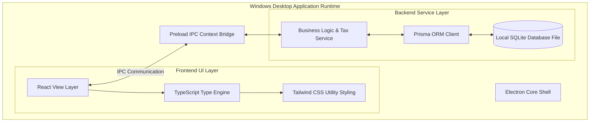

# ALUMFAB POS — PHASE 0 SYSTEM ARCHITECTURE & REQUIREMENTS SPECIFICATION

**Document Version:** 2.0.0  
**Project Name:** ALUMFAB POS  
**Target Operating System:** Windows Desktop (100% Offline Application)  
**Planned Future Tech Stack:** Electron + React + TypeScript + Tailwind CSS + Prisma ORM + SQLite  
**Phase Scope Lock:** Phase 0 Business Requirements & Architecture Finalization  

---

## 1. Project Overview & Architectural Boundaries

### 1.1 Executive Summary
**ALUMFAB POS** is an offline-first Windows desktop Point of Sale (POS) and inventory management system engineered specifically for bulk aluminum profiles, structural metal sections, and aluminum hardware traders.

### 1.2 Core Architectural Principles & Zero Cloud Mandate
1. **100% Offline Operational Integrity**: The application operates completely without internet connectivity, remote API calls, or cloud backends.
2. **Local SQLite Persistence**: Data resides exclusively on the local Windows desktop machine via SQLite (`.db` file).
3. **Integer Money Precision**: Monetary values are stored as integer minor units (paise) to guarantee arithmetic accuracy.
4. **Strict Stock Auditability**: Negative stock balances are strictly forbidden. Stock movements are tracked via an append-only inventory movement ledger.
5. **Practical Business UI**: Clean, responsive, high-contrast user interface prioritizing rapid keyboard entry over decorative visual effects.

---

## 2. Target Technology Architecture Stack



### 2.1 Approved Stack Specifications:
* **Application Shell**: Electron Main & Renderer Process Architecture.
* **Frontend**: React + TypeScript.
* **Styling System**: Tailwind CSS (Simple, high-contrast, professional business application tokens).
* **Inter-Process Communication**: Electron Preload Script with context isolation.
* **Data Access Layer**: Prisma ORM client interfacing with local SQLite database file in `%APPDATA%`.

### 2.2 Prohibited Technologies & Architecture Exclusions:
* 🛑 **No Cloud Databases**: Firebase, Supabase, PostgreSQL, MongoDB, DynamoDB are prohibited.
* 🛑 **No External Authentication**: Cloud auth, OAuth, or online user identity services are excluded.
* 🛑 **No Online APIs or HTTP Endpoints**: Zero network calls or external web dependencies.
* 🛑 **No Express.js / Web Servers**: Electron IPC operates locally within the desktop app runtime.
* 🛑 **No Multi-Tenant Architecture**: Single company, single-branch local desktop deployment model.

---

## 3. UI/UX Design System Rules

### 3.1 Design Guidelines & Typography
* **Aesthetic**: Clean, functional, practical business desktop software appearance.
* **Navigation**: High-legibility sidebar navigation, prominent page headers, auto-focused search inputs.
* **Colors**: High-contrast slate blue and neutral palette (Navy `#0f172a`, Steel `#2563eb`, Success `#16a34a`, Error `#dc2626`).
* **Keyboard Navigation**: Dedicated hotkeys (`F2` search focus, `F8` checkout modal, `Ctrl+Enter` commit sale).

### 3.2 Visual Element Restrictions:
* 🛑 No heavy CSS keyframe animations, spins, or dynamic canvas effects.
* 🛑 No fancy background blurs, glassmorphism, or multi-colored glow gradients.
* 🛑 No unnecessary visual cards, complex dashboard widgets, or decorative layout elements.

---

## 4. Single-Role User Access Model

Version 1 enforces a single-role security model:

### 4.1 Role: `ADMIN`
The `ADMIN` role possesses full operational access:
* System Login.
* Product Master & Category Management.
* Opening Stock Entry & Inventory Movements.
* Sales Billing, Manual Discounts & Price Overrides.
* Customer Directory Management.
* Sales History Audit Logs & Invoice Printing.
* Local Database Backup & Restore operations.

---

## 5. Product & Multi-Unit Engine Specification

### 5.1 Data Model Schema
Products are stored with the following attributes:

| Field | Data Type | Constraint | Description |
| :--- | :--- | :--- | :--- |
| `id` | String | Primary Key | UUID / Auto ID |
| `sku` | String | Unique Index | Unique Product Code / SKU |
| `name` | String | Required | Commercial product name |
| `category` | String | Required | Product category |
| `brand` | String | Optional | Brand or manufacturer |
| `profile` | String | Optional | Profile section specification |
| `size` | String | Optional | Dimension / Size spec |
| `finish` | String | Optional | Surface finish |
| `sellingUnit` | Enum | Required | `KG`, `PCS`, `FT`, `METER`, `LENGTH`, `SET` |
| `sellingPricePaise` | Integer | Required | Base price in paise (1 INR = 100 paise) |
| `gstRate` | Decimal | Required | GST Rate percentage (e.g. 18.0) |
| `priceIncludesGst` | Boolean | Default False | Flag for GST-inclusive price |
| `weightPerPiece` | Decimal | Optional | Weight (KG) per piece if conversion applies |
| `length` | Decimal | Optional | Standard length spec |
| `currentStock` | Decimal | Default 0.0 | Available stock level |
| `minStock` | Decimal | Default 0.0 | Low-stock threshold |
| `isActive` | Boolean | Default True | Active status |

### 5.2 Unit Conversion Rules
For products priced by `PCS` with `weightPerPiece` metadata:
$$\text{Calculated Weight (KG)} = \text{Quantity (PCS)} \times \text{weightPerPiece (KG)}$$
Conversion calculations occur dynamically during item entry and are never forced on products without conversion metadata.

---

## 6. Financial Calculations & GST Tax Engine

### 6.1 Integer Money Arithmetic (Paise Units)
To prevent floating-point rounding errors:
$$\text{Price in Paise} = \text{Round}\left(\text{Price in INR} \times 100\right)$$

### 6.2 Reverse Tax Calculation (GST-Inclusive Prices)
When `priceIncludesGst = True`:
$$\text{Taxable Amount (Paise)} = \text{Round}\left(\frac{\text{Inclusive Amount (Paise)}}{1 + \frac{\text{GST Rate}}{100}}\right)$$
$$\text{GST Amount (Paise)} = \text{Inclusive Amount (Paise)} - \text{Taxable Amount (Paise)}$$

### 6.3 Intra-State vs. Inter-State Tax Breakup
* **Intra-State Transaction**:
  $$\text{CGST (Paise)} = \text{Round}\left(\frac{\text{GST Amount (Paise)}}{2}\right)$$
  $$\text{SGST (Paise)} = \text{GST Amount (Paise)} - \text{CGST (Paise)}$$
* **Inter-State Transaction**:
  $$\text{IGST (Paise)} = \text{GST Amount (Paise)}$$

### 6.4 Manual Discount Rules
* Manual percentage (%) or fixed amount (₹) discounts applied at billing time.
* Stored with sale record (`discountType`, `discountValue`, `discountAmountPaise`, `discountNote`) without modifying the product master catalog price.

---

## 7. Inventory Ledger & Negative Stock Blocking

### 7.1 Append-Only Movement Ledger (`stock_movements`)
All inventory changes are written to an auditable movement ledger:
* Movement Types: `OPENING_STOCK`, `PURCHASE`, `SALE`, `ADJUSTMENT_IN`, `ADJUSTMENT_OUT`.
* Ledger entries store timestamp, movement type, quantity, reference ID, and optional note.
* *Note: `SALE_RETURN` and invoice cancellation workflows are explicitly out of scope for Version 1 and deferred to future phases.*

### 7.2 Zero Negative Stock Rule
Sales resulting in negative stock balances are strictly blocked:
$$\text{Current Stock} - \text{Sale Quantity} \ge 0$$
If stock is insufficient:
1. Block sale processing.
2. Display validation error message stating available stock vs requested quantity.
3. Abort transaction.

---

## 8. POS Sales Workflow & Payment Processing

### 8.1 Workflow Execution Steps
1. **Admin Login** -> Launch POS Terminal.
2. **Select/Create Customer** -> Default or custom customer details.
3. **Search & Add Product** -> Search by Name, SKU, Profile, or Size.
4. **Enter Quantity** -> Quantity input based on selling unit (`KG`, `PCS`, `FT`, `METER`).
5. **Adjust Pricing / Discount** -> Apply authorized manual price adjustment or manual discount.
6. **Stock Pre-Check** -> Validate `currentStock >= saleQty`.
7. **Calculate GST & Taxes** -> Compute Taxable Value, CGST/SGST or IGST.
8. **Select Payment Method**:
   * **CASH**: Process as Cash payment.
   * **CHEQUE**: `chequeNumber` is **MANDATORY**. If cheque number is empty, block sale.
9. **Atomic Database Transaction**:
   * Write `sales` & `sale_items`.
   * Write `stock_movements` ledger entry (`SALE`).
   * Deduct `products.currentStock`.
   * Commit transaction.
10. **Print Tax Invoice** -> Generate & print invoice.

---

## 9. Version 1 Scope Exclusions

### 🛑 Strictly Excluded Features for Version 1:
* **No Sales Returns or Invoice Cancellations** (Sales returns/cancellations will be implemented separately if included in future scope).
* No Credit / Khata / Due Payment balances (All sales paid 100% in full via Cash or Cheque).
* No Digital Payments (UPI, QR Codes, Cards, Net Banking, Wallets).
* No Multi-Role Permissions (Single Admin role).
* No Automatic Customer Discounts or Loyalty Systems.
* No Cloud Backups or Remote API Syncing.

---

## 10. A4 Dual-Copy Tax Invoice Requirements

### 10.1 A4 Dual-Copy Print Engine
Every completed sale generates two distinct invoice copies rendered on standard A4 paper from a single print action:
* **COPY 1**: `CUSTOMER COPY` (Prominently labeled header)
* **COPY 2**: `COMPANY COPY` (Prominently labeled header)

```
+-------------------------------------------------------------------+
|                        ALUMFAB HARDWARE POS                       |
|                   Plot 42, Industrial Area, State                 |
|             GSTIN: 27AAAAA0000A1Z5 | Phone: +91 98765 12345        |
|                                                                   |
| [ CUSTOMER COPY / COMPANY COPY ]              INVOICE: ALF-INV-000001|
| Date: 08/08/2026                             Payment: CHEQUE     |
| Customer: Apex Aluminum Fabricators           Cheque #: 654321    |
+-------------------------------------------------------------------+
| Product        | Description/Profile | Unit | Qty | Rate | Taxable| GST % | Total |
|----------------|---------------------|------|-----|------|--------|-------|-------|
| AL-1801        | 18mm Sliding Track  | KG   | 24  | 310  |  7440  | 18%   | 8779  |
+-------------------------------------------------------------------+
| Subtotal: ₹7,440.00 | Taxable: ₹7,440.00 | CGST (9%): ₹669.60     |
| Discount: ₹0.00     | IGST: ₹0.00        | SGST (9%): ₹669.60     |
|                     |                    | GRAND TOTAL: ₹8,779.20|
+-------------------------------------------------------------------+
```

### 10.2 Mandatory Invoice Attributes

| Invoice Section | Attributes & Data Fields |
| :--- | :--- |
| **Company Header** | Company Name, Company Logo, Address, GSTIN, Phone, State |
| **Invoice Metadata** | Invoice Number (`ALF-INV-XXXXXX`), Date/Time Stamp, Copy Type Indicator |
| **Customer Header** | Customer Name (Required), Address (If provided), GSTIN (If provided), State |
| **Product Table Columns** | Product Code, Description / Profile Spec, Selling Unit, Quantity, Rate, Taxable Amount, GST Rate/Amount, Total Line Amount |
| **Invoice Summary** | Subtotal, Manual Discount Amount, Taxable Amount, CGST (9%), SGST (9%), IGST (18%), Grand Total |
| **Payment Block** | Payment Method (`CASH` or `CHEQUE`), Mandatory Cheque Number (when `CHEQUE`) |

---

## 11. Sequential Unique Invoice Numbering Engine

### 11.1 Numbering Structure & Rules
* **Format**: `{CONFIGURABLE_PREFIX}{6-DIGIT-SEQUENCE}` (Default: `ALF-INV-000001`, `ALF-INV-000002`).
* **Zero Duplication**: Sequence counter stored in database settings; duplicate invoice numbers are strictly prohibited.
* **No Reuse / Silent Recycling**: Existing invoice numbers can never be reused. Deleted or cancelled invoice numbers are never silently recycled.
* **Restart & Backup Resiliency**: Sequence counter state persists across system restarts, application updates, and database backup/restore cycles.
* **Configurable Prefix**: Company Admin can modify invoice prefix (e.g. `ALF-INV-`, `ALUM-2026-`) via Company Settings.

---

## 12. Quotation Module Architectural Readiness

### 12.1 Version 1 Scope Boundary
* 🛑 **Quotation Module is EXPLICITLY OUT OF SCOPE for Version 1**.
* No quotation screens, forms, tables, or conversion workflows are built in initial development.

### 12.2 Architectural Decoupling Rules
The service layer data models are decoupled so future development phases can add Quotations (`Create`, `Edit`, `Print`, `Convert to Sales Invoice`) seamlessly without refactoring core product or GST calculation services.

---

## 13. Sales History Audit & Invoice Reprinting

### 13.1 Sales History Register
Completed invoices are stored immutably in the local SQLite database:
* **Search & Filter Indexes**: Invoice Number, Customer Name, Date Range, Product SKU/Name, Payment Method (`CASH` / `CHEQUE`).
* **Audit Protection**: Completed sales records cannot be casually deleted.

### 13.2 Admin Historical Operations
The Admin can:
1. Search and inspect historical invoice itemization and payment metadata.
2. Reprint dual A4 invoice copies (`CUSTOMER COPY` & `COMPANY COPY`) at any time.

---

## 14. Offline Backup, Restore & Data Safety Engine

Because ALUMFAB POS is a 100% offline desktop application, database backup and restoration are mandatory core capabilities:

### 14.1 Backup Strategy & Modes
1. **Manual Backup**: Admin triggers instant database snapshot on demand.
2. **Automatic Daily Backup**: System creates background daily database snapshot in designated local backup folder.
3. **Backup Naming Convention**:
   `ALUMFAB-POS-YYYY-MM-DD-HHMMSS.db` (e.g. `ALUMFAB-POS-2026-08-08-143000.db`).

### 14.2 Backup Content Scope
Backup files preserve 100% of business state:
* Master Product Catalog & Multi-Unit Configurations.
* Customer Directory.
* Stock Movements Ledger & Current Stock Levels.
* Sales Invoices & Line Item History.
* Sequential Invoice Number Counter State.
* Company Settings & Store Metadata.

### 14.3 Restore & Validation Safety Protocol
* **Pre-Restore Validation**: Before replacing active database, the system validates backup file header, SQLite schema version, and data integrity.
* **Safety Snapshot Creation**: Before replacing active database during restore, the system automatically creates an immediate **Safety Backup** of current active database.
* **Installer Overwrite Protection**: Application installers and software updates MUST NEVER overwrite or erase production `.db` files.

---

## 15. Company Settings & System Configurations

The Admin can configure shop metadata via Company Settings:
* **Company Name**: Business trade name.
* **Company Logo**: Local image asset path for A4 invoice printing.
* **Address**: Registered shop street address.
* **GSTIN**: 15-digit GST Registration Number.
* **Phone Number**: Primary contact phone number.
* **State**: Home state for CGST/SGST vs IGST tax split logic.
* **Invoice Prefix**: Custom prefix string (default `ALF-INV-`).

---

## 16. Final Phase 0 Specification Sign-Off Matrix

| Requirement Domain | Specification Rule | Verification Criteria | Status |
| :--- | :--- | :--- | :--- |
| **Application Environment** | Windows Offline Electron Desktop | Electron + React + TS + Prisma ORM + SQLite with zero cloud APIs | Spec Locked |
| **UI Aesthetics** | Practical Business Desktop UI | Clean forms, clear tables, zero decorative animations or fancy cards | Spec Locked |
| **User Access** | Single Admin Role | Unrestricted Admin authority across all modules | Spec Locked |
| **Product Model** | Multi-Unit & SKU Unique | Supports `KG`, `PCS`, `FT`, `METER`, `LENGTH`, `SET`; SKU indexed | Spec Locked |
| **Tax & Money Logic** | Integer Paise Arithmetic | Money stored as paise; reverse GST calculation supported | Spec Locked |
| **Stock Management** | Zero Negative Stock Ledger | Append-only ledger; transactions exceeding stock level are blocked | Spec Locked |
| **Payment Rules** | Cash & Cheque Only | Cheque number mandatory; credit, due, & digital modes prohibited | Spec Locked |
| **Invoice Print** | Dual A4 Copy Generation | Single print action renders `CUSTOMER COPY` & `COMPANY COPY` | Spec Locked |
| **Invoice Numbers** | Unique Sequence Counter | Non-reusable, non-duplicating sequence preserved across backups | Spec Locked |
| **Quotations** | Out of Scope for V1 | Architecture decoupled for future addition without refactoring | Spec Locked |
| **Data Safety** | Manual & Auto Daily Backup | Validated backup restore with auto Safety Snapshot protection | Spec Locked |

---
*End of Final Phase 0 Specification Document.*

