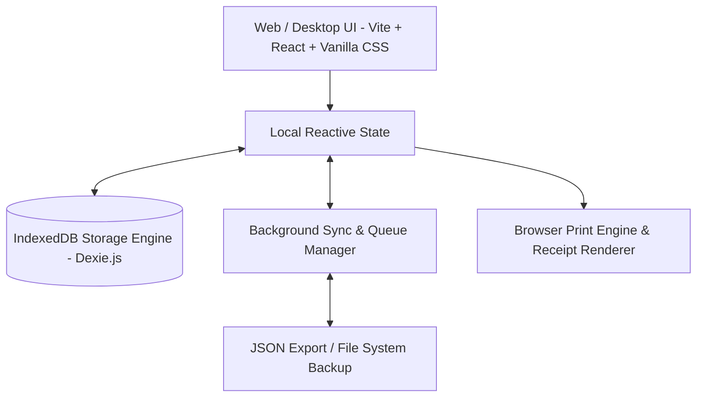

# ALUMFAB OFFLINE POS — PHASE 0 REQUIREMENTS & IMPLEMENTATION SPECIFICATION

**Document Version:** 1.0.2  
**Project Scope:** Offline-First Point of Sale & Inventory Management for Aluminum Fabrication & Hardware  
**Target Environment:** Local Windows / PWA / Web Browser Desktop & Touch Terminals  
**Last Updated:** August 2026  

---

## 1. Executive Summary & Vision

**AlumFab Offline POS** is a specialized, zero-downtime Point of Sale (POS) and business management solution tailored for aluminum fabricators, hardware stores, glass suppliers, and structural metal traders. 

Unlike generic retail POS systems, AlumFab accounts for the specific operational nuances of aluminum fabrication:
- Dual-unit measurement & billing (Weight in kg, Length in feet/meters, Area in sq ft, and Piece counts).
- Dynamic pricing per section based on alloy grade, gauge, surface finish (Anodized, Powder Coated, Wood finish, Mill finish).
- Rapid counter sales with barcode scanning, custom discounts, and fabricator credit accounts (Khata).
- Offline-first operational resiliency to prevent transaction drops during internet outages.
- Built-in aluminum cut list optimization to minimize profile scrap and material wastage.

---

## 2. Phase 0 Objectives & Scope Boundaries

### 2.1 Key Deliverables in Phase 0:
1. **Offline Data Storage Infrastructure (IndexedDB Engine)**: Instant persistence without cloud dependency; background sync queue.
2. **Master Hardware & Profile Catalog**: Comprehensive seed inventory featuring window series (18mm, 27mm, 40mm, Sliding, Casement), louvers, partition sections, glass hardware, and fasteners.
3. **POS Checkout & Billing Terminal**: High-speed counter billing with custom unit conversion (Kg, Meter, Feet, Pcs), instant tax (GST/VAT) split, discount rules, and printable tax receipts.
4. **Aluminum Section Cutting & Scrap Optimizer**: Visual cutter calculator that arranges job cut lists on standard stock lengths (e.g. 12ft, 16ft, 20ft, 6m) to minimize waste.
5. **Customer Credit & Fabricator Ledger (Khata)**: Track outstanding credit balances, partial payments, payment history, and credit limits for contractor clients.
6. **Data Portability & Backup Tools**: One-click JSON database export/import and automated local daily snapshotting.

### 2.2 Backup Preservation Requirements:
The offline backup system **MUST PRESERVE**:
1. **Master Catalog & Section Profiles**: Item codes, names, categories, surface finishes, weight-per-foot specs, rate per kg/pc, stock counts.
2. **Fabricator Accounts & Khata Balances**: Client codes, phone numbers, credit limits, current outstanding balance.
3. **Sales Invoice Register**: Invoice numbers, timestamps, itemized line items, weight totals, tax amounts, payment methods.
4. **Customer Ledger Transaction Timeline**: Complete debit (billed sales) and credit (cash collections) logs with running balance states.
5. **Store Metadata & Settings**: Store name, address, GSTIN, receipt terms, and system configurations.

### 2.3 Out-of-Scope Features for Version 1 / Phase 0:
* 🛑 **Quotations & Pro-Forma Estimates**: Out of scope for Version 1. All counter transactions are direct sales invoices.
* 🛑 **Multi-Branch Inter-Store Transfer**: Out of scope for Phase 0 (Single shop / store desktop deployment).
* 🛑 **Automated Supplier Purchase Order Generation**: Planned for future phase.

---

## 3. System Architecture & Tech Stack

### Architecture Specifications:
* **Frontend Framework**: React 18 / Vite with modular CSS variables & glassmorphism dark/light design tokens.
* **Storage Engine**: `IndexedDB` via `Dexie.js` for fast transactional storage supporting >100,000 items locally.
* **Network Strategy**: Service Worker cache for offline PWA operation + dynamic sync queue to record offline actions.
* **Export & Backup Engine**: Client-side JSON schema validator with timestamped database dumps.

---

## 4. Domain & Functional Modules

### 4.1 Master Catalog & Unit Engine
* **Material Classifications**:
  * Aluminum Profiles (Sliding, Casement, Curtain Wall, Partition, Louver, Structural).
  * Surface Finishes (Mill Finish, Silver Anodized, Bronze Anodized, Powder Coated White/Black/RAL, Wood Grain).
  * Glass & Acrylic (Toughened, Laminated, Frosted, Clear - per sq ft/mm).
  * Hardware & Accessories (Rollers, Locks, Handles, Friction Stays, EPDM Gaskets, Silicone Sealant, Screws).
* **Multi-Unit Pricing Engine**:
  $$\text{Line Item Total} = \left(\text{Qty} \times \text{Weight per Unit (kg)} \times \text{Rate per kg}\right) + \text{Fabrication/Anodizing Surcharge}$$

### 4.2 Counter POS Terminal
* **Barcode & Quick-Search**: Keyboard shortcuts (`F2` search, `F8` checkout, `Ctrl+Enter` print).
* **Line Item Adjustments**: Custom discount per item (%, fixed value), section length selection (e.g. 12ft vs 16ft), finish surcharge.
* **Payment Methods**: Cash, UPI/QR code, Bank Transfer, Customer Credit Account (Debit Khata).
* **Tax Calculation**: Automated IGST/CGST/SGST splitting with round-off logic.

### 4.3 Aluminum Cut List Optimizer
* **Algorithm**: Greedy First Fit Decreasing (FFD) / Knapsack cutting stock algorithm.
* **Inputs**: Stock profile length (e.g. 14.5 ft), blade kerf width (e.g. 3mm / 0.125 in), required cut lengths and quantities.
* **Outputs**: Visual bar diagram showing cut positions, total stock bars required, total scrap length, and efficiency percentage.

### 4.4 Fabricator Credit Ledger (Khata System)
* Track balances per fabricator / customer.
* Record debit (sales invoice) and credit (cash collection, return) entries.
* Real-time credit alert if customer exceeds predefined credit limit.

---

## 5. UI/UX Design Guidelines

1. **Color Palette**:
   - Primary Accent: Precision Electric Blue (`#2563eb` / `#3b82f6`)
   - Industrial Alloy Secondary: Deep Slate & Metallic Teal (`#0f172a`, `#0d9488`)
   - Status Indicators: Emerald (`#10b981`), Amber (`#f59e0b`), Rose (`#f43f5e`)
2. **Typography**: System font stack (`Inter`, `Segoe UI`, system-ui) optimized for high legibility on POS monitors.
3. **Contrast & Touch Accessibility**: Minimum target size of 44x44px for buttons, dark mode toggle for low-light shop floors.

---

## 6. Phase 0 Implementation Plan & Milestones

| Milestone | Description | Status |
| :--- | :--- | :--- |
| **M0.1** | Repository & Tech Stack Setup (Vite React + IndexedDB + Design System) | ✅ Completed |
| **M0.2** | Offline Data Layer & Seed Database (Hardware profiles & finishes) | ✅ Completed |
| **M0.3** | POS Checkout Terminal UI & Order Processing | ✅ Completed |
| **M0.4** | Aluminum Cut List Optimizer Engine | ✅ Completed |
| **M0.5** | Customer Khata & Credit Ledger Module | ✅ Completed |
| **M0.6** | System Verification, Local DB Backup/Restore & Scope Lock | ✅ Completed |
