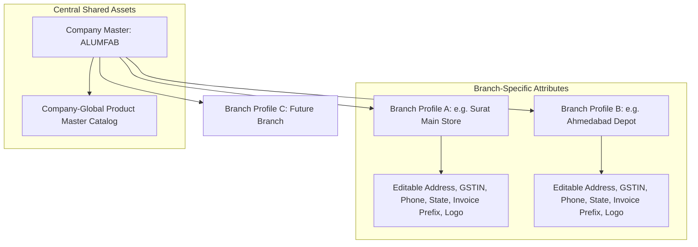
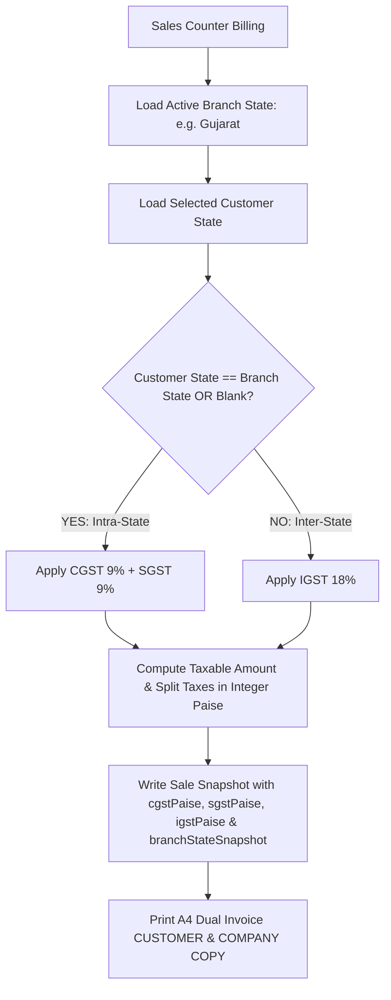
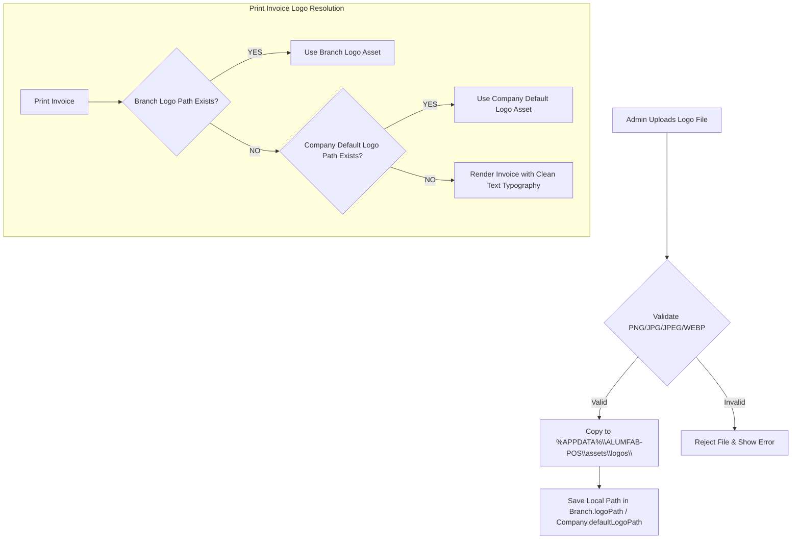
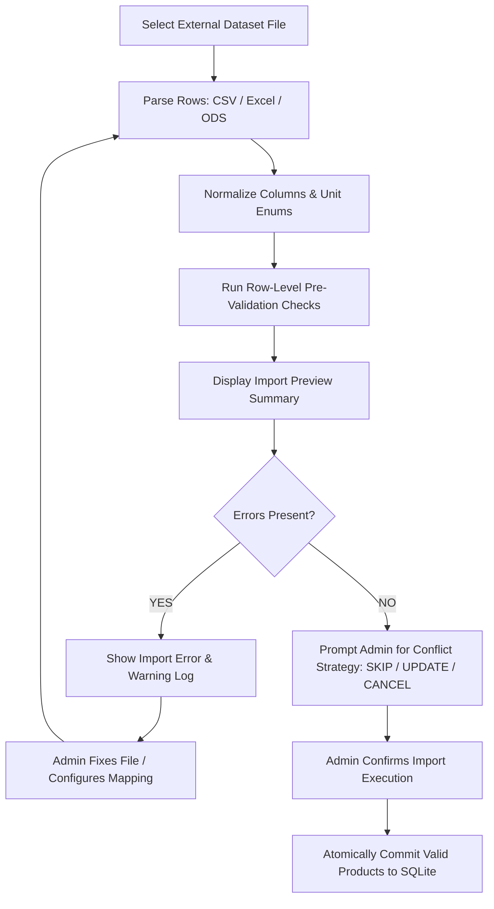
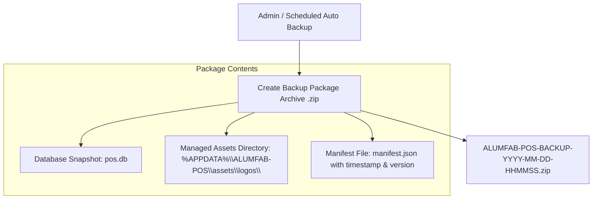

# ALUMFAB POS — PHASE 0 AMENDMENT: BRANCH ARCHITECTURE & PRODUCT DATASET SPECIFICATION

**Document Version:** 2.0.0 (Formal Phase 0 Amendment Specification)  
**Date:** August 2026  
**Status:** APPROVED & LOCKED  
**Application Name:** ALUMFAB POS  
**Target Operating System:** Windows Desktop (100% Offline Application)  
**Target Architecture Stack:** Electron + React + TypeScript + Tailwind CSS + Electron Preload IPC + Service Layer + Prisma ORM + SQLite  
**Production Database Path:** `%APPDATA%\ALUMFAB-POS\database\pos.db`  

---

## 1. APPROVED SYSTEM ARCHITECTURE

The core approved production architecture remains unchanged:
* **Shell & Core**: Electron Desktop Application runtime with IPC context isolation.
* **Frontend UI**: React + TypeScript + Tailwind CSS (Simple, high-contrast desktop business UI).
* **Service Layer**: Offline Business & Tax Calculation Service Layer.
* **Data Access**: Prisma ORM Client connected to a local **SQLite database file (`pos.db`)**.
* **Database Path**: `%APPDATA%\ALUMFAB-POS\database\pos.db`.
* **Connectivity**: 100% Offline (Zero cloud APIs, zero external HTTP dependencies, zero online authentication).

---

## 2. BUSINESS ORGANIZATION MODEL (SINGLE COMPANY, MULTI-BRANCH)

ALUMFAB POS remains a **Single Company** desktop application (not a generic multi-tenant SaaS application). However, the business model is updated from single-store to support **Multiple Editable Branch Profiles** under the central ALUMFAB company identity.



---

## 3. COMPANY MASTER DATA MODEL

The `Company Master` entity contains organization-level central identity only.

```prisma
model Company {
  id                 String   @id @default(uuid())
  companyName        String   @default("ALUMFAB")
  defaultLogoPath    String?  // Optional central company default logo local path
  createdAt          DateTime @default(now())
  updatedAt          DateTime @updatedAt
  branches           Branch[]
}
```

* **Company Name**: Centrally editable by Admin.
* **Decoupling**: Branch-specific GSTIN, address, phone, and state are **NOT** stored exclusively in `Company`. They belong to `Branch`.

---

## 4. BRANCH MASTER DATA MODEL

`Branch` is introduced as a core domain entity representing physical store or warehouse operational profiles.

```prisma
model Branch {
  id                 String            @id @default(uuid())
  companyId          String
  company            Company           @relation(fields: [companyId], references: [id])
  name               String            // Required Branch Name (e.g. "Surat Main Store")
  address            String?           // Optional multiline address
  gstin              String?           // Optional 15-digit GSTIN
  phone              String?           // Optional contact phone
  state              String?           // Optional state (e.g. "Gujarat") for GST splitting
  invoicePrefix      String            @default("ALF-INV-") // Editable sequence prefix
  logoPath           String?           // Optional branch-specific logo local path
  isActive           Boolean           @default(true)
  createdAt          DateTime          @default(now())
  updatedAt          DateTime          @updatedAt
  inventories        BranchInventory[]
  sales              Sale[]
  stockMovements     StockMovement[]
  invoiceSequences   InvoiceSequence[]
}
```

---

## 5. BRANCH FIELD EDITABILITY RULES

The following Branch parameters **MUST be fully editable by Admin** via the application UI:
* `address` (Multiline text)
* `gstin` (15-digit GSTIN text)
* `phone` (Contact number text)
* `state` (State name text for GST logic)
* `invoicePrefix` (Custom prefix text, e.g. `SRT-INV-`, `AMD-INV-`)
* `logoPath` (Local image file path)

*Constraint*: These parameters must **NEVER** be hard-coded into source code or invoice templates. They must be loaded dynamically from the local database.

---

## 6. ADDRESS FIELD SPECIFICATION
* **Blank Initial State**: Branch address supports a blank initial state (`address = null / ""`).
* **Multiline Support**: Admin can enter multiline street address, industrial zone, city, and pincode details.
* **No Over-Normalization**: Address is stored as a single clean multiline string field in Version 1.

---

## 7. GSTIN FIELD SPECIFICATION
* **Branch-Specific GSTIN**: Each branch can maintain its own GSTIN or leave it blank during initial setup.
* **Validation & Normalization Rules**:
  1. Trim leading/trailing whitespace.
  2. Auto-convert input to **UPPERCASE**.
  3. Validate 15-digit alphanumeric GSTIN structure before save.
* **No Auto-Copying**: One branch GSTIN is **NEVER** automatically copied to other branches unless Admin explicitly chooses to do so.

---

## 8. PHONE FIELD SPECIFICATION
* **Branch-Specific Phone**: Editable per branch.
* **Blank Initial State**: Optional during branch creation.
* **Invoice Rendering**: Displayed on printed invoices when present; omitted when blank.

---

## 9. STATE FIELD & GST CALCULATION SPECIFICATION
* **Branch State**: Editable per branch (e.g. `Gujarat`).
* **Tax Evaluation Decision Matrix**:
  * **Intra-State Sale (`Branch State == Customer State` or Customer State omitted)**:
    $$\text{CGST} = 50\% \text{ of GST Rate}, \quad \text{SGST} = 50\% \text{ of GST Rate}, \quad \text{IGST} = 0$$
  * **Inter-State Sale (`Branch State != Customer State`)**:
    $$\text{CGST} = 0, \quad \text{SGST} = 0, \quad \text{IGST} = 100\% \text{ of GST Rate}$$

### 9.1 Branch-Wise GST Execution Flow



---

## 10. LOCAL LOGO MANAGEMENT SPECIFICATION



### Technical Requirements:
1. **100% Local File Storage**: Logo files are copied to `%APPDATA%\ALUMFAB-POS\assets\logos\` with a unique filename (e.g. `logo_branch_srt_1712345678.png`). Temporary external file paths are never referenced directly.
2. **Supported Formats**: `PNG`, `JPG`, `JPEG`, `WEBP`.
3. **Logo Replacement & Deletion**:
   * **Replacement**: Upload new file -> Copy safely to local asset directory -> Update DB reference -> Delete old app-managed file.
   * **Deletion**: Clear DB reference -> Delete local file -> Print engine gracefully renders text-only company header without broken image placeholders.
4. **Resolution Hierarchy**:
   $$\text{Active Logo} = \text{Branch Logo} \;\text{if present, ELSE}\; \text{Company Default Logo} \;\text{if present, ELSE}\; \text{Text-Only Header}$$

---

## 11. ACTIVE BRANCH CONCEPT
* Every transaction in the system executes under an **Active Branch** context.
* During counter login or app launch, the application loads the configured Active Branch (`MAIN_STORE` by default).
* In multi-branch desktop setups, Admin can select the Active Branch context for sales billing, stock management, and reports.

---

## 12. BRANCH SAFETY RULE (`Sale.branchId`)
* **Mandatory Relationship**: Every finalized sale MUST be linked to a specific `branchId`. A sale record without a `branchId` is invalid and forbidden.
* **Audit & Reports**: Ensures complete isolation of sales history, inventory deduction, state tax evaluation, and branch performance reporting.

---

## 13. HISTORICAL INVOICE IMMUTABILITY & BRANCH SNAPSHOT

```
+-----------------------------------------------------------------------------------+
|                        HISTORICAL INVOICE SNAPSHOT RULE                           |
+-----------------------------------------------------------------------------------+
|  Store Profile (March 2026):                                                     |
|    Address: "Plot 42, Industrial Area, Surat"                                    |
|                                                                                   |
|  Admin Edits Address (April 2026):                                                |
|    Address: "Building 90, GIDC Tech Park, Surat"                                 |
|                                                                                   |
|  Reprint March Invoice:                                                           |
|    MUST DISPLAY: "Plot 42, Industrial Area, Surat"  (Historic Snapshot)         |
|    MUST NOT DISPLAY: "Building 90, GIDC Tech Park, Surat" (Current Setting)      |
+-----------------------------------------------------------------------------------+
```

### Snapshot Schema Contract:
When a sale is finalized, the `Sale` record stores an immutable historical snapshot of the branch attributes active at that exact moment:

```prisma
model Sale {
  id                     String   @id @default(uuid())
  invoiceNo              String   @unique
  branchId               String
  branch                 Branch   @relation(fields: [branchId], references: [id])
  
  // Historical Branch Snapshot Fields (Immutable):
  branchNameSnapshot     String
  branchAddressSnapshot  String?
  branchGstinSnapshot    String?
  branchPhoneSnapshot    String?
  branchStateSnapshot    String?
  invoicePrefixSnapshot  String
  logoSnapshot           String?
  
  // Customer & Financial Fields:
  customerId             String
  customer               Customer @relation(fields: [customerId], references: [id])
  customerNameSnapshot   String
  customerAddressSnapshot String?
  customerGstinSnapshot  String?
  customerStateSnapshot  String?
  
  subtotalPaise          Int
  discountType           DiscountType @default(NONE)
  discountValue          Decimal      @default(0.0)
  discountAmountPaise    Int          @default(0)
  taxableAmountPaise     Int
  cgstPaise              Int
  sgstPaise              Int
  igstPaise              Int
  grandTotalPaise        Int
  totalWeightKg          Decimal      @default(0.0)
  
  items                  SaleItem[]
  payment                Payment?
  createdAt              DateTime     @default(now())
}
```

### 13.1 SaleItem Historical Snapshot Model
When a sale is committed, every `SaleItem` line item preserves an immutable historical snapshot of the product specifications, selling rates, and tax split details active at billing time:

```prisma
model SaleItem {
  id                      String      @id @default(uuid())
  saleId                  String
  sale                    Sale        @relation(fields: [saleId], references: [id])
  productId               String
  product                 Product     @relation(fields: [productId], references: [id])
  
  // Historical Product Snapshot Fields (Immutable):
  productSkuSnapshot      String      // e.g. "AL-1801" or "H101"
  productNameSnapshot     String      // e.g. "18mm Window Sliding Top Track"
  profileSnapshot         String?     // Profile section spec
  alloySnapshot           String?     // Alloy grade (e.g. "6063-T6")
  finishSnapshot          String?     // Surface finish
  sellingUnitSnapshot     SellingUnit // KG, PCS, FT, METER, LENGTH, SET
  
  // Quantity, Weight & Rate Snapshots:
  quantity                Decimal
  unitPricePaise          Int         // Agreed selling rate in integer paise
  weightPerPieceSnapshot  Decimal?    // Weight conversion spec active at sale
  totalWeightKg           Decimal     @default(0.0)
  
  // Monetary & Tax Breakdown Snapshots (Integer Paise):
  lineTotalPaise          Int         // Gross line total in paise
  gstRateSnapshot         Decimal     // GST percentage active at sale
  taxableAmountPaise      Int         // Computed taxable value in paise
  gstAmountPaise          Int         // Total GST in paise
  cgstPaise               Int         // 50% CGST if Intra-State
  sgstPaise               Int         // 50% SGST if Intra-State
  igstPaise               Int         // 100% IGST if Inter-State
}
```

---

## 14. BRANCH-AWARE INVOICE NUMBERING

Invoice numbering supports branch-specific sequence prefixes (e.g. Surat: `SRT-INV-000001`, Ahmedabad: `AMD-INV-000001`).

```prisma
model InvoiceSequence {
  id          String   @id @default(uuid())
  branchId    String
  branch      Branch   @relation(fields: [branchId], references: [id])
  prefix      String   // e.g. "SRT-INV-" or "ALF-{YYYY}{MM}-"
  nextNumber  Int      @default(1)
  updatedAt   DateTime @updatedAt

  @@unique([branchId, prefix])
}
```

### Sequence Constraints:
1. **Uniqueness**: Invoice numbers must be globally unique and sequential per branch prefix.
2. **Non-Recycling**: Sequence numbers are never reused, silently recycled, or overwritten across restarts or month resets.
3. **Backup Preservation**: Sequence counters are backed up and restored atomically with database snapshots.

---

## 15. BRANCH-AWARE INVOICE PRINTING ENGINE
When printing an invoice:
1. Load historical snapshot attributes from the `Sale` record (`branchNameSnapshot`, `branchAddressSnapshot`, `branchGstinSnapshot`, `branchPhoneSnapshot`, `branchStateSnapshot`, `logoSnapshot`).
2. Generate standard **A4 paper** print output.
3. Single print action renders two copies: `CUSTOMER COPY` & `COMPANY COPY`.

---

## 16. BRANCH-AWARE INVENTORY ARCHITECTURE (`BranchInventory`)

Product catalog definitions are **Company-Global**, but stock balances are maintained per branch via `BranchInventory`.

```prisma
model BranchInventory {
  id           String   @id @default(uuid())
  branchId     String
  branch       Branch   @relation(fields: [branchId], references: [id])
  productId    String
  product      Product  @relation(fields: [productId], references: [id])
  quantity     Decimal  @default(0.0) // Available stock at this branch
  minStock     Decimal  @default(0.0)
  updatedAt    DateTime @updatedAt

  @@unique([branchId, productId])
}
```

---

## 17. GLOBAL PRODUCT MASTER CATALOG
* **Single Central Catalog**: Products (`Product` entity) are **Company-Global**.
* All branches share the central catalog definitions (SKUs, Commercial Names, Categories, Brands, Profiles, Sizes, Alloys, Finishes, Base Selling Prices, GST Rates, Selling Units).
* Product master catalog entries are **NOT** duplicated per branch.

```
Example:
  Product Master SKU: AL-1801 (18mm Window Sliding Top Track) - Price: ₹310/kg - GST: 18%
  ├── Branch A (Surat): Available Stock = 450.0 KG
  └── Branch B (Ahmedabad): Available Stock = 210.0 KG
```

---

## 18. BRANCH STOCK MOVEMENTS & PER-BRANCH ZERO NEGATIVE STOCK

Every stock movement links to a specific `branchId`:

```prisma
model StockMovement {
  id          String       @id @default(uuid())
  branchId    String
  branch      Branch       @relation(fields: [branchId], references: [id])
  productId   String
  product     Product      @relation(fields: [productId], references: [id])
  type        MovementType
  quantity    Decimal
  unit        SellingUnit
  referenceNo String?
  notes       String?
  createdAt   DateTime     @default(now())
}
```

### Per-Branch Zero Negative Stock Rule:
Stock pre-checks validate against the **Active Branch Inventory**:
$$\text{BranchInventory.quantity (Active Branch)} - \text{Requested Sale Qty} \ge 0$$
*Rule*: If Branch A has 5 PCS and Branch B has 20 PCS, a sale of 7 PCS at Branch A **MUST BE BLOCKED** due to insufficient stock at Branch A, despite company-wide stock equaling 25 PCS.

---

## 19. REAL PRODUCT DATASET RECOGNITION (`hardware(1).ods` / `hardware.ods`)

The company spreadsheet [`hardware.ods`](file:///C:/Users/Suvidh/Documents/hardware_app/hardware.ods) (182 hardware/extrusion items) is formally recognized as an official product dataset source for ALUMFAB POS.

### Dataset Mapping Contract:
* `HardwareName` -> `Product.name`
* `ProductCode` -> `Product.sku` (Unique SKU index)
* `Price` -> `Product.sellingPricePaise` (Paise units: $\text{Price} \times 100$)
* `Per` -> `Product.sellingUnit` (`PCS`, `KG`, `FT`, `METER`, `LENGTH`, `SET`)
* `Barcode` -> `Product.barcode` (Optional barcode string)

---

## 21. OBSERVED DATASET MAPPING & INGESTION ARCHITECTURE
The production application will **NEVER** hard-code product rows into source files. All catalog seeding relies on dynamic ingestion of external dataset files (`hardware(1).ods` / `hardware.ods`).

### Explicit Column Mapping:
* `HardwareName` -> `Product.name`
* `ProductCode` -> `Product.sku` (Unique Product Code index)
* `Price` -> `Product.sellingPricePaise` (Converted to integer paise: $\text{Price} \times 100$)
* `Per` -> `Product.sellingUnit` (Normalized enum)
* `Barcode` -> `Product.barcode` (Optional barcode string identifier)

---

## 22. PRODUCT UNIT NORMALIZATION & `RFT` PRESERVED UNIT RULE
* **Case-Insensitive Normalization**: Importer normalizes variations such as `Pcs`, `pcs`, `PCS` -> `PCS`.
* **`RFT` (Running Feet) Handling Rule**:
  * Importer does **NOT** silently alter `RFT` into `FT` without explicit company confirmation.
  * Importer stores `sellingUnit` as `RFT` (or `FT` upon confirmation) while preserving `sourceUnit = "RFT"` in importer audit metadata to prevent data loss.

---

## 23. PRODUCT IMPORT VALIDATION RULES
Before committing imported records to SQLite, the importer runs pre-validation checks:

| Validation Condition | Classification | System Action |
| :--- | :--- | :--- |
| **Product Name Missing** | **ERROR** | Reject row |
| **Product Code / SKU Missing** | **ERROR / WARNING** | Flag row for manual SKU entry |
| **Duplicate Product Code / SKU** | **ERROR** | Flag conflict; trigger conflict policy |
| **Duplicate Barcode** | **WARNING / ERROR** | Flag duplicate barcode warning |
| **Negative or Invalid Price** | **ERROR** | Reject row |
| **Price = 0.00** | **WARNING** | Flag zero-price item for Admin review |
| **Unknown / Unmapped Unit** | **WARNING** | Prompt Admin for unit mapping |
| **Empty Barcode** | **ALLOWED** | Barcode is optional; allow empty field |

---

## 24. MANDATORY IMPORT EXECUTION PIPELINE
Datasets must **NEVER** be written directly into the production database without pre-validation preview:



---

## 25. IMPORT RESULT PREVIEW SUMMARY
The import preview screen displays real dataset execution statistics:
* `Total Rows`: Count of total dataset records parsed.
* `Valid Rows`: Count of clean records ready for import.
* `Warnings`: Count of items with non-critical warnings (e.g. zero price).
* `Errors`: Count of invalid items blocked from import.
* `New Products`: Count of new SKUs to be inserted.
* `Updated Products`: Count of existing SKUs to be updated (if strategy = `UPDATE EXISTING`).
* `Skipped`: Count of existing SKUs skipped (if strategy = `SKIP`).

---

## 26. PRODUCT UPDATE & CONFLICT POLICY
When an imported SKU already exists in the Product Master catalog, the Admin MUST choose an explicit conflict strategy:
1. **`SKIP`**: Retain current database catalog record; ignore imported row.
2. **`UPDATE EXISTING`**: Update existing catalog price and details with imported values.
3. **`CANCEL IMPORT`**: Abort the import operation.

*Rule*: Existing product prices are **NEVER** silently overwritten without explicit Admin choice.

---

## 27. INTEGER PAISE MONEY CONVERSION
* Raw dataset prices (decimal numbers e.g. `125.50`) are parsed and converted to integer paise at import time:
  $$\text{sellingPricePaise} = \text{Round}\left(\text{Price} \times 100\right) = 12550\text{ paise}$$
* Authoritative accounting and tax arithmetic use integer paise exclusively to prevent floating-point money discrepancies.

---

## 28. GST DATASET GAP & OPTIONAL FIELDS POLICY
* The hardware spreadsheet dataset (`hardware.ods`) contains base prices and units but lacks optional metadata (`gstRate`, `priceIncludesGst`, `category`, `brand`, `profile`, `size`, `alloy`, `finish`, `weightPerPiece`, `length`).
* **Optional Field Rule**: Missing fields remain `null / optional` until enriched by Admin or a secondary dataset. The system does **NOT** invent dummy values or hardcode 18% GST across all products.

---

## 29. REVISED PRODUCT MASTER DATA MODEL

```prisma
model Product {
  id                String            @id @default(uuid())
  sku               String            @unique
  name              String
  barcode           String?
  categoryId        String?
  category          Category?         @relation(fields: [categoryId], references: [id])
  brand             String?
  profile           String?
  size              String?
  alloy             String?
  finish            String?
  sellingUnit       SellingUnit
  sourceUnit        String?           // Original imported unit (e.g. "RFT")
  sellingPricePaise Int
  gstRate           Decimal?          // Optional until enriched by Admin
  priceIncludesGst  Boolean           @default(false)
  weightPerPiece    Decimal?
  length            Decimal?
  minStock          Decimal           @default(0.0)
  isActive          Boolean           @default(true)
  createdAt         DateTime          @default(now())
  updatedAt         DateTime          @updatedAt
  branchInventories BranchInventory[]
  stockMovements    StockMovement[]
  saleItems         SaleItem[]
}
```

---

## 30. REVISED CORE DOMAIN ENTITY LIST
The conceptual Phase 0 domain entities are locked to the following 14 core models:
1. `Company` — Organization master identity.
2. `Branch` — Editable branch profiles (Address, GSTIN, Phone, State, Invoice Prefix, Logo).
3. `CompanySetting` — System configuration key-value parameters.
4. `Product` — Company-global product master catalog.
5. `Category` — Product classification categories.
6. `BranchInventory` — Per-branch stock balances (`branchId + productId`).
7. `StockMovement` — Auditable stock movement ledger (`branchId`, `type`, `quantity`).
8. `Customer` — Customer directory.
9. `Sale` — Invoice header with immutable historical branch & customer snapshots.
10. `SaleItem` — Invoice line items with unit price paise and tax splits.
11. `Payment` — Settlement record (`CASH` or `CHEQUE` with mandatory Cheque #).
12. `InvoiceSequence` — Branch-aware invoice sequence counter (`branchId + prefix -> nextNumber`).
13. `BackupMetadata` — Database snapshot log.
14. `AuditLog` — Admin operational audit log.

---

## 31. BRANCH-AWARE SALES ENTITY & GST FLOW
* `Sale` contains `branchId`, `customerId`, `invoiceNo`, integer paise financials, `cgstPaise`, `sgstPaise`, `igstPaise`, and immutable branch & customer snapshots.
* Payment modes are strictly **CASH** and **CHEQUE** (mandatory Cheque #).
* If required state data is missing, the billing engine prompts Admin to complete required store/customer state details before generating a GST invoice.

---

## 32. ASSET-AWARE BACKUP PACKAGE & LOGO BACKUP RULES



### Technical Backup Rules:
1. **Asset Bundle Archive**: Database backups generate a **Backup Package Archive** (`.zip`) containing:
   * Production SQLite Database (`pos.db`)
   * Application-managed logo assets (`%APPDATA%\ALUMFAB-POS\assets\logos\`)
   * Backup Manifest (`manifest.json` with timestamp, database version, asset count)
2. **Safe Restore Engine**: Restoring a backup restores both database records and managed logo files simultaneously, ensuring reprinted invoices never suffer broken logo branding references.

---

## 33. AMENDMENT COMPLIANCE STATEMENT

**"Phase 0 requirements, specifications, dataset amendments, and import architecture are complete, locked, and approved."**  
*Phase 1 implementation will NOT start automatically. The repository is prepped and standing by for formal Phase 0 approval.*

