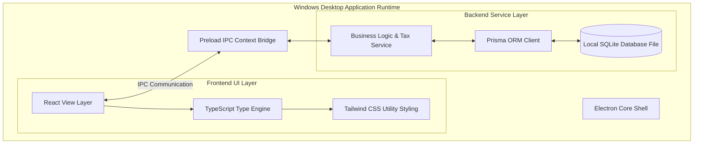

# ALUMFAB POS — PHASE 0 SYSTEM ARCHITECTURE & REQUIREMENTS SPECIFICATION

**Document Version:** 2.2.0  
**Project Name:** ALUMFAB POS  
**Target Operating System:** Windows Desktop (100% Offline Application)  
**Planned Future Tech Stack:** Electron + React + TypeScript + Tailwind CSS + Prisma ORM + SQLite  
**Phase Scope Lock:** Phase 0 Business Requirements & Architecture Finalization  

---

## 1. Project Overview & Architectural Boundaries

### 1.1 Executive Summary
**ALUMFAB POS** is an offline-first Windows desktop Point of Sale (POS) and inventory management system engineered specifically for bulk aluminum profiles, structural metal sections, and aluminum hardware traders.

### 1.2 Core Architectural Principles & Zero Cloud Mandate
1. **100% Offline Operational Integrity**: The application operates completely without internet connectivity, remote API calls, or cloud backends.
2. **Local SQLite Persistence**: Data resides exclusively on the local Windows desktop machine via SQLite (`.db` file) in `%APPDATA%\ALUMFAB-POS\database\pos.db`.
3. **Integer Money Precision**: Monetary values are stored as integer minor units (paise, $1\text{ INR} = 100\text{ paise}$) to guarantee arithmetic accuracy.
4. **Strict Stock Auditability**: Negative stock balances are strictly forbidden. Stock movements are tracked via an append-only inventory movement ledger.
5. **Practical Business UI**: Clean, responsive, high-contrast user interface prioritizing rapid keyboard entry over decorative visual effects.

---

## 2. Target Technology Architecture Stack

### 2.1 Approved Stack Specifications:
* **Application Shell**: Electron Main & Renderer Process Architecture.
* **Frontend**: React + TypeScript.
* **Styling System**: Tailwind CSS (Simple, high-contrast, professional business application tokens).
* **Inter-Process Communication**: Electron Preload Script with context isolation.
* **Data Access Layer**: Prisma ORM client interfacing with local SQLite database file in `%APPDATA%`.

### 2.2 Prohibited Technologies & Architecture Exclusions:
* 🛑 **No Cloud Databases**: Firebase, Supabase, PostgreSQL, MongoDB, DynamoDB are prohibited.
* 🛑 **No External Authentication**: Cloud auth, OAuth, or online user identity services are excluded.
* 🛑 **No Online APIs or HTTP Endpoints**: Zero network calls or external web dependencies.
* 🛑 **No Express.js / Web Servers**: Electron IPC operates locally within the desktop app runtime.
* 🛑 **No Multi-Tenant Architecture**: Single company, single-branch local desktop deployment model.

---

## 3. UI/UX Design System Rules

### 3.1 Design Guidelines & Typography
* **Aesthetic**: Clean, functional, practical business desktop software appearance.
* **Navigation**: High-legibility navigation, prominent headers, auto-focused search inputs.
* **Colors**: High-contrast slate blue and neutral palette (Navy `#0f172a`, Steel `#2563eb`, Success `#16a34a`, Error `#dc2626`).
* **Keyboard Navigation**: Dedicated hotkeys (`F2` search focus, `F8` checkout modal, `Ctrl+Enter` commit sale).

### 3.2 Visual Element Restrictions:
* 🛑 No heavy CSS keyframe animations, spins, or dynamic canvas effects.
* 🛑 No fancy background blurs, glassmorphism, or multi-colored glow gradients.
* 🛑 No unnecessary visual cards, complex dashboard widgets, or decorative layout elements.

---

## 4. User Access Model

Version 1 uses a **direct-access model** — the application launches immediately into the POS interface with no login screen or authentication gate. This is appropriate for a single-machine, single-operator local desktop deployment.

> 🛑 Login / Authentication is **explicitly out of scope for V1**. The `ADMIN` concept exists at the data/role level for future multi-user expansion but no login UI, password storage, or session management is implemented in V1.

---

## 5. Product & Multi-Unit Engine Specification

### 5.1 Data Model Schema
Products are stored with the following attributes:

| Field | Data Type | Constraint | Description |
| :--- | :--- | :--- | :--- |
| `id` | String | Primary Key | UUID / Auto ID |
| `sku` | String | Unique Index | Unique Product Code / SKU |
| `name` | String | Required | Commercial product name |
| `category` | String | Required | Product category |
| `brand` | String | Optional | Brand or manufacturer |
| `profile` | String | Optional | Profile section specification |
| `size` | String | Optional | Dimension / Size spec |
| `alloy` | String | Optional | Alloy Grade (e.g. 6063-T6, 6061-T6) |
| `finish` | String | Optional | Surface finish |
| `sellingUnit` | Enum | Required | `KG`, `PCS`, `FT`, `METER`, `LENGTH`, `SET` |
| `sellingPricePaise` | Integer | Required | Base price in paise (1 INR = 100 paise) |
| `gstRate` | Decimal | Required | GST Rate percentage (e.g. 5.0, 12.0, 18.0, 28.0) |
| `priceIncludesGst` | Boolean | Default False | Flag for GST-inclusive price |
| `weightPerPiece` | Decimal | Optional | Weight (KG) per piece if conversion applies |
| `length` | Decimal | Optional | Standard length spec |
| `currentStock` | Decimal | Default 0.0 | Available stock level |
| `minStock` | Decimal | Default 0.0 | Low-stock threshold |
| `isActive` | Boolean | Default True | Active status |

### 5.2 Unit Conversion Rules
For products priced by `PCS` with `weightPerPiece` metadata:
$$\text{Calculated Weight (KG)} = \text{Quantity (PCS)} \times \text{weightPerPiece (KG)}$$
Conversion calculations occur dynamically during item entry and are never forced on products without conversion metadata.

---

## 6. Financial Calculations & GST Tax Engine

### 6.1 Integer Money Arithmetic (Paise Units)
To prevent floating-point rounding errors:
$$\text{Price in Paise} = \text{Round}\left(\text{Price in INR} \times 100\right)$$

### 6.2 Reverse Tax Calculation (GST-Inclusive Prices)
When `priceIncludesGst = True`:
$$\text{Taxable Amount (Paise)} = \text{Round}\left(\frac{\text{Inclusive Amount (Paise)}}{1 + \frac{\text{GST Rate}}{100}}\right)$$
$$\text{GST Amount (Paise)} = \text{Inclusive Amount (Paise)} - \text{Taxable Amount (Paise)}$$

### 6.3 Intra-State vs. Inter-State Tax Breakup
The tax type is determined by comparing the Store/Branch State with the Customer State:

* **Intra-State Transaction (`Branch State == Customer State` or Customer State omitted)**:
  Applies CGST + SGST (50% CGST + 50% SGST split):
  $$\text{CGST (Paise)} = \text{Round}\left(\frac{\text{GST Amount (Paise)}}{2}\right)$$
  $$\text{SGST (Paise)} = \text{GST Amount (Paise)} - \text{CGST (Paise)}$$
  $$\text{IGST (Paise)} = 0$$

* **Inter-State Transaction (`Branch State != Customer State`)**:
  Applies 100% IGST (Integrated GST):
  $$\text{CGST (Paise)} = 0$$
  $$\text{SGST (Paise)} = 0$$
  $$\text{IGST (Paise)} = \text{GST Amount (Paise)}$$

### 6.4 Manual Discount Rules
* Manual percentage (%) or fixed amount (₹) discounts applied at billing time.
* Stored with sale record (`discountType`, `discountValue`, `discountAmountPaise`, `discountNote`) without modifying the product master catalog price.

---

## 7. Inventory Ledger & Negative Stock Blocking

### 7.1 Append-Only Movement Ledger (`stock_movements`)
All inventory changes are written to an auditable movement ledger:
* Movement Types: `OPENING_STOCK`, `PURCHASE`, `SALE`, `ADJUSTMENT_IN`, `ADJUSTMENT_OUT`.
* Ledger entries store timestamp, movement type, quantity, reference ID, and optional note.
* *Note: `SALE_RETURN` is allowed as a schema capability for future compatibility, but Sales Returns UI/workflow is explicitly out of scope for Version 1.*

### 7.2 Zero Negative Stock Rule
Sales resulting in negative stock balances are strictly blocked:
$$\text{Current Stock} - \text{Sale Quantity} \ge 0$$
If stock is insufficient:
1. Block sale processing.
2. Display validation error message stating available stock vs requested quantity.
3. Abort transaction.

---

## 8. POS Sales Workflow & Payment Processing

### 8.1 Workflow Execution Steps
1. **Launch App** → Direct access to POS Terminal (no login required).
2. **Select/Create Customer** → Default or custom customer details.
3. **Search & Add Product** -> Search by Name, SKU, Profile, or Size.
4. **Enter Quantity** -> Quantity input based on selling unit (`KG`, `PCS`, `FT`, `METER`).
5. **Adjust Pricing / Discount** -> Apply authorized manual price adjustment or manual discount.
6. **Stock Pre-Check** -> Validate `currentStock >= saleQty`.
7. **Calculate GST & Taxes** -> Compute Taxable Value, CGST/SGST or IGST.
8. **Select Payment Method**:
   * **CASH**: Process as Cash payment.
   * **CHEQUE**: `chequeNumber` is **MANDATORY**. If cheque number is empty, block sale.
9. **Atomic Database Transaction**:
   * Write `sales` & `sale_items`.
   * Write `stock_movements` ledger entry (`SALE`).
   * Deduct `products.currentStock`.
   * Commit transaction.
10. **Print Tax Invoice** -> Generate & print invoice.

---

## 9. Version 1 Scope Exclusions

### 🛑 Strictly Excluded Features for Version 1:
* **No Sales Returns or Invoice Cancellations** (Sales returns/cancellations will be implemented separately if included in future scope).
* **No Credit / Khata / Due Payment balances** (All sales paid 100% in full via Cash or Cheque).
* **No Digital Payments** (UPI, QR Codes, Cards, Net Banking, Wallets).
* **No Multi-Role Permissions** (Single Admin role).
* **No Automatic Customer Discounts or Loyalty Systems**.
* **No Cloud Backups or Remote API Syncing**.

---

## 10. A4 Dual-Copy Tax Invoice Requirements

### 10.1 A4 Dual-Copy Print Engine
Every completed sale generates two distinct invoice copies rendered on standard A4 paper from a single print action:
* **COPY 1**: `CUSTOMER COPY` (Prominently labeled header)
* **COPY 2**: `COMPANY COPY` (Prominently labeled header)

### 10.2 Mandatory Invoice Attributes
* **Company Header**: Company Name, Logo, Address, GSTIN, Phone, State.
* **Invoice Metadata**: Invoice Number (`ALF-INV-000001`), Date/Time Stamp, Copy Type Indicator.
* **Customer Details**: Customer Name (Required), Address (If provided), GSTIN (If provided), State.
* **Product Table Columns**: Product Code, Description / Profile Spec, Selling Unit, Quantity, Rate, Taxable Amount, GST Rate/Amount, Total Line Amount.
* **Invoice Summary**: Subtotal, Manual Discount Amount, Taxable Amount, CGST (9%), SGST (9%), IGST (18%), Grand Total.
* **Payment Block**: Payment Method (`CASH` or `CHEQUE`), Mandatory Cheque Number (when `CHEQUE`).

---

## 11. Sequential Unique Invoice Numbering Engine
* **Format**: `{CONFIGURABLE_PREFIX}{6-DIGIT-SEQUENCE}` (Default: `ALF-INV-000001`).
* **Dynamic Date Tokens**: Sequence engine supports optional date tokens in prefix (e.g. `ALF-{YYYY}{MM}-` resolves to `ALF-202601-000001` for January 2026 sales).
* **Zero Duplication**: Sequence counter stored in database settings; duplicate invoice numbers are strictly prohibited.
* **No Reuse / Silent Recycling**: Existing invoice numbers can never be reused, silently recycled, or overwritten across month/year resets.
* **Configurable Prefix**: Company Admin can modify invoice prefix (`ALF-INV-`) via Company Settings.

---

## 12. Offline Backup, Restore & Data Safety Engine
* **Dual Backup Modes**: Manual Backup + Automatic Daily Backup (`ALUMFAB-POS-YYYY-MM-DD-HHMMSS.db`).
* **Pre-Restore Validation**: Backup file header and SQLite schema version must be validated before restore.
* **Pre-Restore Safety Snapshot**: System automatically creates an immediate **Safety Backup** of the current active production database before replacing data during restore. Application updates MUST NEVER overwrite production database files.

---

## 13. Company Settings & Configurations
* **Configurable Parameters**: Store Name, Address, GSTIN, Phone, State, Logo path, Invoice Prefix (`ALF-INV-`), Default Currency (**INR / ₹**), Backup Directory.
* **Initial Blank State Support**: Business profile parameters (Address, GSTIN, Phone, State, Logo path) may initially remain blank or use default placeholders during project setup, and can be edited or updated at any time by the authorized Admin via the Company Settings UI. Missing store metadata does NOT block application launch or sales billing.

---
*End of Requirements Specification Document.*
